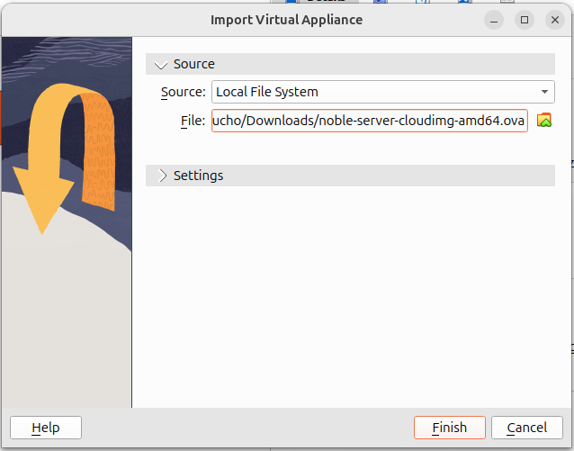
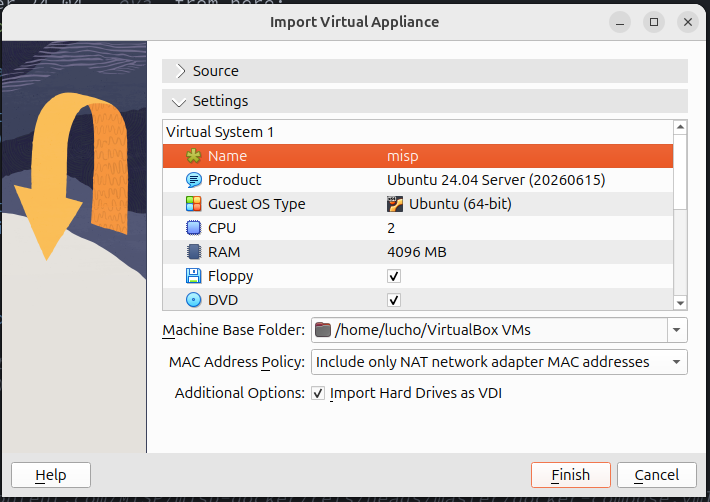
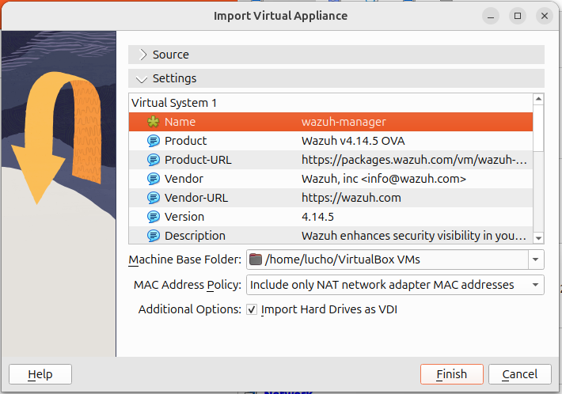

# MISP Integration Workshop — CIRCL - Installation & Network Setup

> This document describes how to build the lab environment **from scratch**: importing
> the base VMs, configuring the host-only network, and installing MISP and Wazuh.
>
> The resulting VMs are distributed as pre-configured `.ova` images for the workshop.
> If you already have those images, you can skip this document and go straight to
> [TUTORIAL.md](TUTORIAL.md).

## Lab layout

```bash
192.168.56.1    the host itself (VirtualBox assigns this to vboxnet0)
192.168.56.10   wazuh-manager VM
192.168.56.20   wazuh-agent-01 VM
192.168.56.30   misp docker
192.168.56.50   flowintel VM
```

## 0 - Host-only network (do this once)

```bash
# Create the host-only network (gives you vboxnet0) and set the host's IP
VBoxManage hostonlyif create
VBoxManage hostonlyif ipconfig vboxnet0 --ip 192.168.56.1 --netmask 255.255.255.0

# Disable VirtualBox's host-only DHCP so it doesn't fight your static IPs
VBoxManage dhcpserver remove --ifname vboxnet0
```

---

## 1 - MISP VM

### 1.1 - Importing the base VM

You can download an Ubuntu Server 24.04 `.ova` from here:
* https://cloud-images.ubuntu.com/noble/current/noble-server-cloudimg-amd64.ova

1. Import the appliance into Oracle Virtual Box by going to `File` -> `Import Appliance`.

    


2. Go to _Settings_ and change the name of the VM to `misp` and set the RAM to 4096 MB:
    

3. Click on _Finish_.

### 1.2 - Networking

Attach the two adapters to the `misp` VM (powered off):
```bash
$ VBoxManage modifyvm "misp" --nic1 nat --nic2 hostonly --hostonlyadapter2 vboxnet0
```

Set `root` password:
```bash
sudo virt-customize -a /home/lucho/VirtualBox\ VMs/misp/ubuntu-noble-24.04-cloudimg.vdi \
      --root-password password:root \
      --run-command 'usermod -U root'
```

Configure ssh:

```bash
# vim /etc/ssh/sshd_config.d/99-enable-pw.conf
```
Add:
```
PasswordAuthentication yes
PermitRootLogin yes
```

Restart ssh:
```bash
ssh-keygen -A
systemctl restart ssh
```

Change hostname to `misp`:
```bash
echo "misp" > /etc/hostname
```

Cofigure static IP address:

```bash
root@ubuntu:~# vim /etc/netplan/99-lab.yaml
```

Write the following configuration:
```bash
network:
  version: 2
  ethernets:
    enp0s3:                 # NAT — internet
      dhcp4: true
    enp0s8:                 # host-only — lab traffic
      dhcp4: false
      addresses:
        - 192.168.56.30/24
```

Apply configuration:
```bash
chmod 600 /etc/netplan/99-lab.yaml
netplan apply
ip a show enp0s8            # confirm 192.168.56.30
```

Resize VM volume:
```bash
TMPDIR=/dev/shm growpart /dev/sda 1
resize2fs /dev/sda1
df -h /                       # confirm / is now larger
```

### 1.3 - Installing `misp-docker`

0. Install `docker engine` and docker compose`:
    * https://docs.docker.com/engine/install/ubuntu/ 
    * https://docs.docker.com/compose/install/linux/

1. Grab just the compose file
```bash
mkdir misp && cd misp

curl -O https://raw.githubusercontent.com/MISP/misp-docker/refs/heads/master/docker-compose.yml
```
2. Create your .env 
```bash
curl -o .env https://raw.githubusercontent.com/MISP/misp-docker/refs/heads/master/template.env
```

3. Edit .env (see below)
```bash
vim .env

BASE_URL=https://192.168.56.30
ADMIN_EMAIL=admin@admin.test
ADMIN_PASSWORD=...                 # or use the generated default
```

4. PUll images and Start MISP
```bash
docker compose pull
docker compose up -d
```

Once the stack is up, MISP is reachable at `https://192.168.56.30`.

---

## 2 - Wazuh Manager VM

### 2.1 - Import Wazuh `.ova`

1. Download the `.ova` Wazuh virtual machine from:
    * https://documentation.wazuh.com/current/deployment-options/virtual-machine/virtual-machine.html

2. Import the appliance into Oracle Virtual Box by going to `File` -> `Import Appliance`.

    

3. Go to _Settings_ and change the name of the VM to `wazuh-manager`:
    

4. Click on _Finish_.

### 2.2 - Networking

Attach the two adapters to the `wazuh-manager` VM (powered off):
```bash
$ VBoxManage modifyvm "wazuh-manager" --nic1 nat --nic2 hostonly --hostonlyadapter2 vboxnet0
```

Get interfaces mac addresses:
```bash
$ VBoxManage showvminfo "wazuh-manager" | grep -i "host-only\|nic"
NIC 1:                       MAC: 0800272778B9, Attachment: NAT, Cable connected: on, Trace: off (file: none), Type: 82545EM, Reported speed: 0 Mbps, Boot priority: 0, Promisc Policy: deny, Bandwidth group: none
NIC 1 Settings:
NIC 2:                       MAC: 080027CE133C, Attachment: Host-only Interface 'vboxnet0', Cable connected: on, Trace: off (file: none), Type: 82540EM, Reported speed: 0 Mbps, Boot priority: 0, Promisc Policy: deny, Bandwidth group: none
```


Delete exisiting eth0 conf:
```bash
rm /etc/systemd/network/20-eth0.network
```

Modify `nat` config to match the mac address of the NAT interface:

`/etc/systemd/network/20-nat.network`: 
```conf
[Match]
MACAddress=08:00:27:27:78:B9

[Network]
DHCP=yes
```

Modify `hostonly` config to match the mac address of the Host-only interface:

`/etc/systemd/network/20-hostonly.network`: 
```conf
[Match]
MACAddress=08:00:27:CE:13:3C

[Network]
Address=192.168.56.10/24
```


Restart the network service:
```bash
sudo networkctl reload
sudo networkctl reconfigure eth0 eth1     # or just: systemctl restart systemd-networkd
ip -br addr                          # confirm 192.168.56.10 is now on the 08:00:27:ce:13:3c interface
```

---

## 3 - Wazuh Agent host (Ubuntu Server)

You can download an Ubuntu Server 24.04 `.ova` from here:
* https://cloud-images.ubuntu.com/noble/current/noble-server-cloudimg-amd64.ova

Impor the appliance in Oracle Virtual Box following the same steps as before.

### 3.1 - Networking

1. Set Ubuntu Server root password:
    ```bash
    $ sudo apt install libguestfs-tools -y
    ...
    $ sudo virt-customize -a /home/lucho/VirtualBox\ VMs/wazuh-agent-01/ubuntu-noble-24.04-cloudimg.vdi \
      --root-password password:root \
      --run-command 'usermod -U root'
    [   0.0] Examining the guest ...
    [  24.0] Setting a random seed
    [  24.1] Running: usermod -U root
    [  24.2] Setting passwords
    [  24.9] SELinux relabelling
    [  25.0] Finishing off
    ```
2. Configure ssh:

```bash
# vim /etc/ssh/sshd_config.d/99-enable-pw.conf
```
Add:
```
PasswordAuthentication yes
PermitRootLogin yes
```

Restart ssh:
```bash
ssh-keygen -A
systemctl restart ssh
```

Change hostname to `wazuh-agent-01`:
```bash
echo "wazuh-agent-01" > /etc/hostname
```

Attach Host-only interface:
```bash
$ VBoxManage modifyvm "wazuh-agent-01" --nic2 hostonly --hostonlyadapter2 vboxnet0
```

Cofigure static IP address:
```bash
root@ubuntu:~# vim /etc/netplan/99-lab.yaml
```


Write the following configuration:
```yaml
network:
  version: 2
  ethernets:
    enp0s3:                 # NAT — internet
      dhcp4: true
    enp0s8:                 # host-only — lab traffic
      dhcp4: false
      addresses:
        - 192.168.56.20/24
```

Apply configuration:
```bash
chmod 600 /etc/netplan/99-lab.yaml
netplan apply
ip a show enp0s8            # confirm 192.168.56.20
```

### 3.2 - Install the Wazuh Agent

1. Login via ssh:
```bash
# ssh root@192.168.56.20
...
root@wazuh-agent-01:~#
```bash
2. Install _Wazuh Agent_:
```bash
apt-get install gnupg apt-transport-https
curl -s https://packages.wazuh.com/key/GPG-KEY-WAZUH | gpg --no-default-keyring --keyring gnupg-ring:/usr/share/keyrings/wazuh.gpg --import && chmod 644 /usr/share/keyrings/wazuh.gpg
echo "deb [signed-by=/usr/share/keyrings/wazuh.gpg] https://packages.wazuh.com/4.x/apt/ stable main" | tee -a /etc/apt/sources.list.d/wazuh.list
apt-get update
```

```bash
WAZUH_MANAGER="192.168.56.10" apt-get install wazuh-agent
```

> Replace `192.168.56.10` with your _Wazuh Manager_ IP.

> To change the IP address of the _Wazuh Manager_ after the agent installation, edit the `/var/ossec/etc/ossec.conf` configuration file.

More info:
* https://documentation.wazuh.com/current/installation-guide/wazuh-agent/wazuh-agent-package-linux.html

---

Install `osquery`:

1. Go to https://osquery.io/downloads/official and download the latest `osquery` version.

2. Install `osquery`:
  ```bash
  $ chmod +x osquery_X.XX.X.linux_amd64.deb
  $ dpkg -i chmod +x osquery_X.XX.X.linux_amd64.deb
  ```

3. To run `osquery` locally without a server:
  ```bash
  # osqueryi
  Using a virtual database. Need help, type '.help'
  osquery> 
  ```

Install `Yara`:
1. Go to https://github.com/VirusTotal/yara/releases and download the latest `yara` version.
```bash
sudo curl -LO https://github.com/VirusTotal/yara/archive/refs/tags/vX.X.X.tar.gz
sudo apt update
sudo apt install -y make gcc autoconf libtool libssl-dev pkg-config jq
sudo curl -LO https://github.com/VirusTotal/yara/archive/vX.X.X.tar.gz
sudo tar -xvzf vX.X.X.tar.gz -C /usr/local/bin/ && rm -f vX.X.X.tar.gz
cd /usr/local/bin/yara-X.X.X/
sudo ./bootstrap.sh && sudo ./configure && sudo make && sudo make install && sudo make check
```

### 3.3 - Install Suricata

Suricata runs on this same agent host and inspects the **host-only lab interface**
(`enp0s8`, `192.168.56.20`), so it sees the lab traffic used in the
[Log4Shell scenario](LOG4SHELL.md) and the MISP IoC matching described in
[TUTORIAL.md](TUTORIAL.md) §4.

1. Install a recent Suricata from the official OISF stable PPA (the Ubuntu-shipped
   package lags behind):
   ```bash
   apt-get install -y software-properties-common
   add-apt-repository -y ppa:oisf/suricata-stable
   apt-get update
   apt-get install -y suricata jq
   ```

2. Point Suricata at the host-only interface and set the lab as `HOME_NET`. Edit
   `/etc/suricata/suricata.yaml`:
   ```bash
   vim /etc/suricata/suricata.yaml
   ```
   ```yaml
   vars:
     address-groups:
       HOME_NET: "[192.168.56.0/24]"

   af-packet:
     - interface: enp0s8      # host-only lab interface
   ```

   > You can also set the capture interface once at install time by editing
   > `/etc/default/suricata` (`IFACE=enp0s8`), which the systemd unit reads on start.

3. Fetch the ruleset and confirm the config parses:
   ```bash
   suricata-update                      # downloads the ET Open ruleset into /var/lib/suricata/rules/
   suricata -T -c /etc/suricata/suricata.yaml -v   # -T = test config, must report "Configuration provided was successfully loaded"
   ```

4. Enable the service so it starts now and on every boot, then confirm it is sniffing
   and writing events:
   ```bash
   systemctl enable --now suricata
   systemctl status suricata --no-pager           # confirm active (running)
   tail -f /var/log/suricata/eve.json | jq        # confirm JSON events are being written
   ```

The `/var/lib/suricata/rules/` directory and `/var/log/suricata/eve.json` output created
here are exactly what the MISP integration in [TUTORIAL.md](TUTORIAL.md) §4 builds on
(the `misp-iocs-ips.lst` dataset, `misp.rules`, and the `eve-log` output).

More info:
* https://docs.suricata.io/en/latest/install.html

### 3.4 - Install Zeek

Zeek runs on this same agent host and, like Suricata, watches the **host-only lab
interface** (`enp0s8`, `192.168.56.20`). It produces rich, protocol-aware connection logs
(`conn.log`, `dns.log`, `http.log`, …) that complement Suricata's alerts and feed the
network IOC monitoring described in [TUTORIAL.md](TUTORIAL.md) ("Zeek - Monitor network
IOCs").

1. Install Zeek from the official OpenSUSE Build Service repository (the LTS build for
   Ubuntu 24.04 "noble"):
   ```bash
   echo 'deb http://download.opensuse.org/repositories/security:/zeek/xUbuntu_24.04/ /' \
     | tee /etc/apt/sources.list.d/security:zeek.list
   curl -fsSL https://download.opensuse.org/repositories/security:zeek/xUbuntu_24.04/Release.key \
     | gpg --dearmor | tee /etc/apt/trusted.gpg.d/security_zeek.gpg > /dev/null
   apt-get update
   apt-get install -y zeek-lts
   ```

   > Zeek installs under `/opt/zeek`. Add it to your `PATH` for the current session with
   > `export PATH=/opt/zeek/bin:$PATH` (or append it to `/etc/profile.d/zeek.sh`).

2. Point Zeek at the interface that carries the traffic you want to inspect and set the
   lab as the local network. Edit `/opt/zeek/etc/node.cfg`:
   ```bash
   vim /opt/zeek/etc/node.cfg
   ```
   ```ini
   [zeek]
   type=standalone
   host=localhost
   interface=enp0s3          # egress/NAT interface — carries connections to external IPs
   ```

   > Use the **egress** interface (`enp0s3`, the one with the `10.0.2.x` NAT address) if you
   > want to detect connections to *external* malicious IPs (e.g. the MISP IOC demo in the
   > tutorial) — that traffic leaves via NAT, not the host-only `enp0s8`. Watch `enp0s8`
   > instead only if you care about VM-to-VM lab traffic.

   Then declare the local networks in `/opt/zeek/etc/networks.cfg`:
   ```ini
   192.168.56.0/24    Lab host-only network
   10.0.2.0/24        VirtualBox NAT network
   ```

3. Install the [`zeekjs-misp`](https://github.com/awelzel/zeekjs-misp) plugin, which the
   MISP integration in [TUTORIAL.md](TUTORIAL.md) ("Zeek - Monitor network IOCs") relies on
   to pull IOCs from MISP into Zeek's Intel framework. It is a `zkg` package built on
   **ZeekJS** (Zeek's JavaScript support), so Node.js and its headers are required to build
   it:
   ```bash
   /opt/zeek/bin/zkg autoconfig                     # point zkg at this Zeek install (once)
   apt-get install -y nodejs libnode-dev cmake g++  # ZeekJS build dependencies
   # --force skips the confirmation prompts; --user-var supplies the zeekjs dependency's
   # nodejs_root_dir (blank = auto-detect). Do NOT `echo yes |` this — zkg prompts twice
   # and a one-line pipe hits EOF on the second prompt.
   /opt/zeek/bin/zkg install --force --user-var nodejs_root_dir= zeekjs-misp
   ```
   Confirm the package is installed and loadable:
   ```bash
   /opt/zeek/bin/zkg list
   /opt/zeek/bin/zeek -e '@load zeekjs-misp' -e 'print "ok"'   # prints "ok", no "can't find" error
   ```

   > **Build needs RAM.** Compiling the `zeekjs` engine embeds the V8/libnode headers and
   > can push the compiler past ~1&nbsp;GB. On a small VM the build dies with
   > `c++: fatal error: Killed signal terminated program cc1plus` (the OOM killer). Give the
   > VM ≥4&nbsp;GB, or add temporary swap, then re-run the `zkg install`:
   > ```bash
   > fallocate -l 4G /swapfile && chmod 600 /swapfile && mkswap /swapfile && swapon /swapfile
   > ```

   > The MISP connection settings (`MISP::url`, `MISP::api_key`, `zeek:ingest` tag filter,
   > …) are added to `/opt/zeek/share/zeek/site/local.zeek` in the tutorial, not here.

4. Check the config, then deploy (this compiles the config and starts the Zeek process):
   ```bash
   /opt/zeek/bin/zeekctl check
   /opt/zeek/bin/zeekctl deploy
   /opt/zeek/bin/zeekctl status      # confirm the 'zeek' node is running
   ```

5. Confirm logs are being written to `/opt/zeek/logs/current/`:
   ```bash
   ls /opt/zeek/logs/current/
   tail -f /opt/zeek/logs/current/conn.log
   ```

`zeekctl deploy` also installs a cron entry (via `zeekctl cron`) that restarts Zeek if it
dies and rotates logs, so it survives reboots once deployed. The logs under
`/opt/zeek/logs/` are what the network IOC monitoring in [TUTORIAL.md](TUTORIAL.md) builds
on.

More info:
* https://docs.zeek.org/en/master/install.html

## 4 - Wazuh <-> MISP integration script installation

1. Pull the integration script into the Wazuh integrations directory
```bash
sudo curl -fsSL https://raw.githubusercontent.com/wazuh/integrations/refs/heads/main/integrations/misp/custom-misp.py \
  -o /var/ossec/integrations/custom-misp.py
```
2. Set ownership and permissions on the script
```bash
sudo chown root:wazuh /var/ossec/integrations/custom-misp.py
sudo chmod 750 /var/ossec/integrations/custom-misp.py
```
3. Create the log directory the script writes to and hand it to wazuh
```bash
sudo mkdir -p /var/log/wazuh-misp
sudo chown wazuh:wazuh /var/log/wazuh-misp
```


## 5 - Flowintel VM

[Flowintel](https://github.com/flowintel/flowintel) is the collaborative case-management
tool used for incident triage in the [Log4Shell scenario](LOG4SHELL.md) (Stage 4). It runs
on its own VM at `192.168.56.50`, reachable at `http://192.168.56.50`.

```bash
sudo virt-customize -a /home/lucho/VirtualBox\ VMs/flowintel/ubuntu-noble-24.04-cloudimg.vdi \
      --root-password password:root \
      --run-command 'usermod -U root'
```

Resize VM volume:
```bash
TMPDIR=/dev/shm growpart /dev/sda 1
resize2fs /dev/sda1
df -h /                       # confirm / is now larger
```

Attach Host-only interface:
```bash
$ VBoxManage modifyvm "flowintel" --nic2 hostonly --hostonlyadapter2 vboxnet0
```

Log in into the VM with root/root.

Change hostname to `flowintel`:
```bash
echo "flowintel" > /etc/hostname
```

Configure ssh:

```bash
# vim /etc/ssh/sshd_config.d/99-enable-pw.conf
```
Add:
```
PasswordAuthentication yes
PermitRootLogin yes
```

Restart ssh:
```bash
ssh-keygen -A
systemctl restart ssh
```

Cofigure static IP address:
```bash
root@ubuntu:~# vim /etc/netplan/99-lab.yaml
```

Write the following configuration:
```yaml
network:
  version: 2
  ethernets:
    enp0s3:                 # NAT — internet
      dhcp4: true
    enp0s8:                 # host-only — lab traffic
      dhcp4: false
      addresses:
        - 192.168.56.50/24
```

Apply configuration:
```bash
chmod 600 /etc/netplan/99-lab.yaml
netplan apply
ip a show enp0s8            # confirm 192.168.56.50
```

Install and configure Flowintel:
```bash
apt update
apt install git
git clone https://github.com/flowintel/flowintel.git
cd flowintel
cp conf/config.py.default conf/config.py
cp conf/config_module.py.default conf/config_module.py
```

```bash
vim conf/config.py
```

Set the webserver IP and port:
```python
FLASK_URL = "192.168.56.50"
FLASK_PORT = "80"
```

Launch the application manually (to confirm it works before enabling the service):
```bash
./launch.sh -l
```

Go to http://192.168.56.50

```
email: admin@admin.admin
password: admin
```

### Run Flowintel at boot

`launch.sh -l` runs the Flask app in the foreground (starting the FCM and misp-modules
helpers in detached `screen` sessions), so a simple systemd service can supervise it and
start it automatically when the VM boots. Stop the manual run (`Ctrl+C`) first, then create
the unit:

```bash
# vim /etc/systemd/system/flowintel.service
```

```ini
[Unit]
Description=Flowintel case-management web app
After=network-online.target
Wants=network-online.target

[Service]
Type=simple
User=root
WorkingDirectory=/root/flowintel
ExecStart=/bin/bash /root/flowintel/launch.sh -l
Restart=on-failure
RestartSec=5

[Install]
WantedBy=multi-user.target
```

Enable it so it starts now and on every boot:
```bash
systemctl daemon-reload
systemctl enable --now flowintel
systemctl status flowintel --no-pager     # confirm it is active (running)
```

After a reboot, Flowintel comes back up on its own at http://192.168.56.50. Logs are
available via `journalctl -u flowintel -f`.