# MISP Integration Workshop — CIRCL - Walkthrough

> This walkthrough assumes you are using the **pre-configured `.ova` images** provided
> for the workshop. The `misp`, `wazuh-manager` and `wazuh-agent-01` VMs are already
> installed, networked and ready to start — just import each appliance into Oracle
> VirtualBox and power it on.
>
> If you need to build the lab environment from scratch (VM import, host-only network,
> static IPs, installing MISP and Wazuh), see [INSTALLATION.md](INSTALLATION.md).

## What this workshop covers

This lab connects two open-source tools:

* **MISP** — a Threat Intelligence Platform used to collect, store and share Indicators
  of Compromise (IOCs) such as malicious IPs, domains and file hashes. Data is organised
  into _events_ (a report about an incident or campaign) made up of _attributes_ (the
  individual IOCs).
* **Wazuh** — an open-source security platform (SIEM/XDR). A central **Wazuh Manager**
  analyses data shipped by lightweight **Wazuh Agents** installed on monitored hosts.

The end goal is to use MISP as a threat-intel source for Wazuh: as agents report file and
network activity, the Wazuh Manager queries MISP and raises an alert whenever an observed
hash, IP or domain matches a known IOC.

Part 1 sets up and explores MISP; Part 2 deploys Wazuh and wires the two together.

## Lab layout

```
192.168.56.1    the host itself (VirtualBox assigns this to vboxnet0)
192.168.56.10   wazuh-manager VM
192.168.56.20   wazuh-agent-01 VM
192.168.56.30   misp docker
192.168.56.50   flowintel VM
```

## 1 - MISP

### 1.1 - Accessing MISP

With the pre-configured `misp` VM running, MISP is reachable on the host-only network
using the default credentials:

```
URL: https://192.168.56.30
user: admin@admin.test
password: admin
```

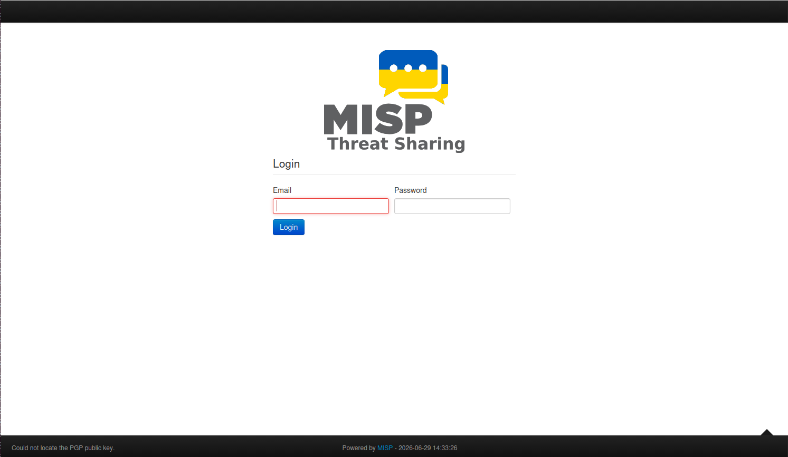

> Your browser will warn about the self-signed TLS certificate — this is expected for a
> local lab instance. Accept the exception and continue.

### 1.2 - Organisations and Users

In MISP every event and attribute belongs to an **Organisation**, which identifies who
produced or owns the data. Working under your own organisation (rather than the built-in
admin org) keeps ownership clear and is what remote instances rely on when deciding what
to share with you during synchronisation.

#### 1.2.2 - Create your own Organisation
Go to `Administration` -> `Add Organisations`:

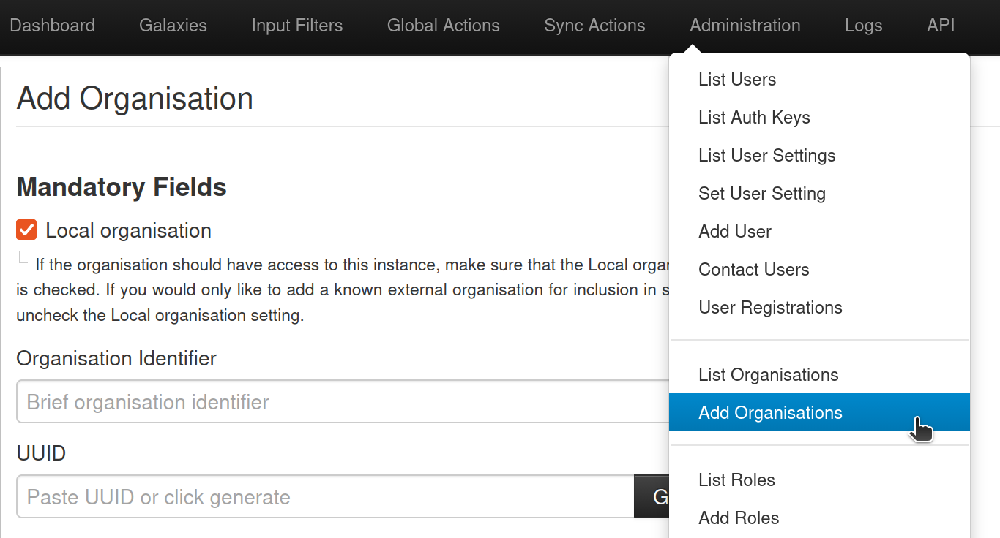

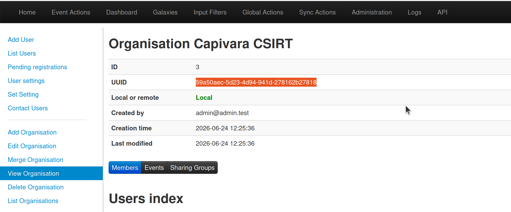

#### 1.2.3 - Create a OrgAdmin User
Go to `Administration` -> `Add User`:

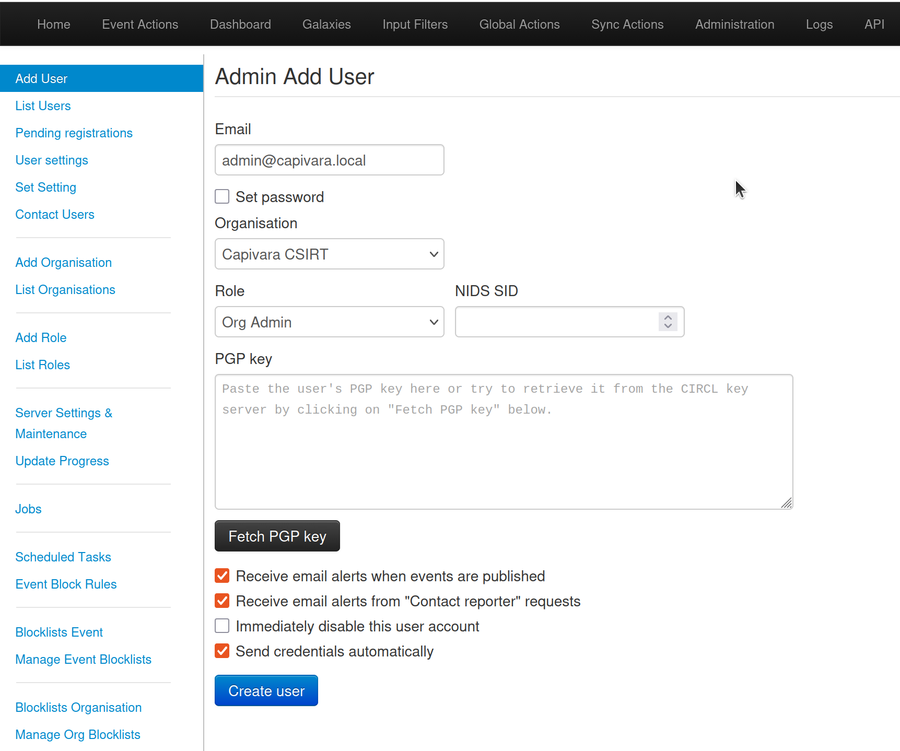

> The _admin_ user should not be used for regular MISP usage as it is against best practices.


### 1.3 - Tags

MISP lets you label events and attributes with **tags**, which drive filtering, sharing
decisions (e.g. who an event may be distributed to) and automation. Tags come from two
sources, both of which you enable here:

* **Taxonomies** — curated, namespaced vocabularies of tags (e.g. `tlp:red`,
  `workflow:state="complete"`). Enabling a taxonomy makes its tags available for use.
* **Galaxies** — richer "knowledge packs" of clustered intelligence (threat actors,
  malware families, attack techniques, sectors, countries) that attach like tags but
  carry extra structured context.

#### 1.3.1 - Taxonomies
Go to `Event Actions` -> `List Taxonomies`

Enable the following _Taxonomies_:
* TLP
* workflow
* circl
* PAP
* vulnerability

#### 1.3.2 - Galaxies

Go to `Galaxies` -> `List Galaxies`:
- Country
- Sector
- Attack Pattern
- Malware

> All _Galaxies_ are enabled by default when using `misp-docker`.

### 1.4 - Feeds

A **Feed** is an external source of MISP events that your instance pulls on a schedule —
the simplest way to populate MISP with community threat intel, without setting up a full
server-to-server connection. Two per-feed options are worth understanding:

* **Caching** stores the feed's IOCs in a fast lookup index, so you can correlate your
  own data against them without importing every event in full.
* **Lookup visible** makes those cached values appear in correlations and the UI.

#### 1.4.1 - Adding a Feed

1. Go to `Sync actions` -> `Feeds`
By default there are two feeds added in the default `misp-docker` installation.

    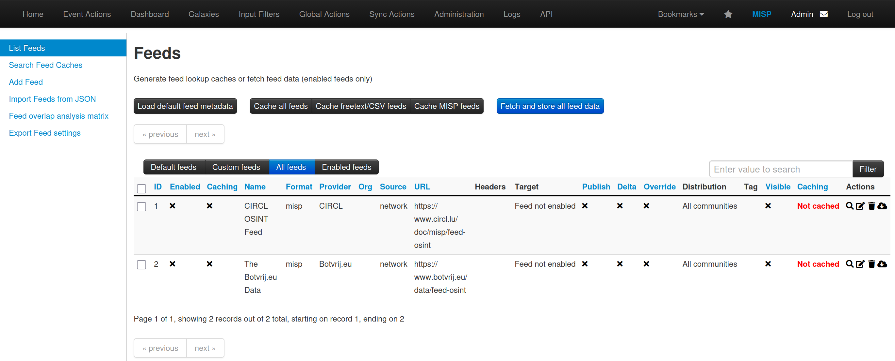

2. Edit the CIRCL OSINT Feed:

    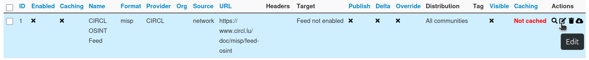

3. Modify _Feed_ filter rules:

    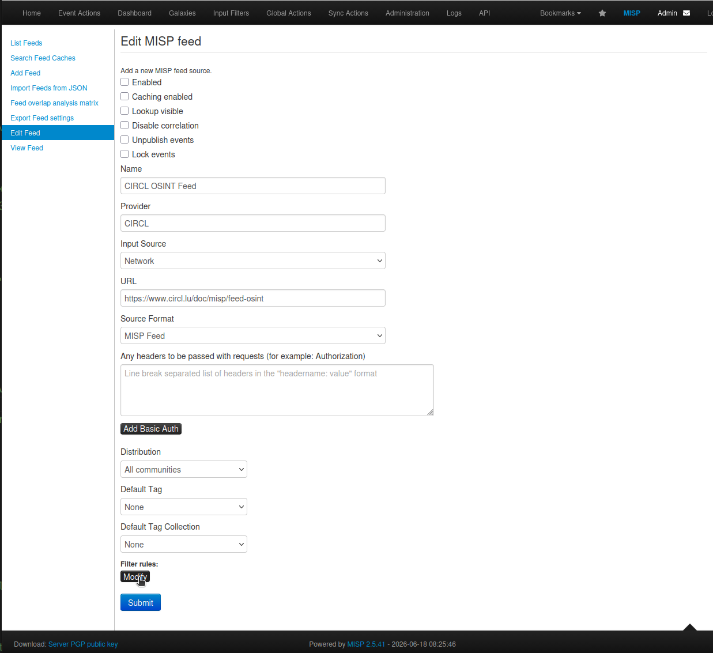
4. Fetch only **CIRCL** events and only events published in the last 30 days:

    > The full CIRCL OSINT feed is large. Restricting it to a single organisation and a
    > short time window keeps the import small and quick for the lab — in production you
    > would tune these filters to your needs.

    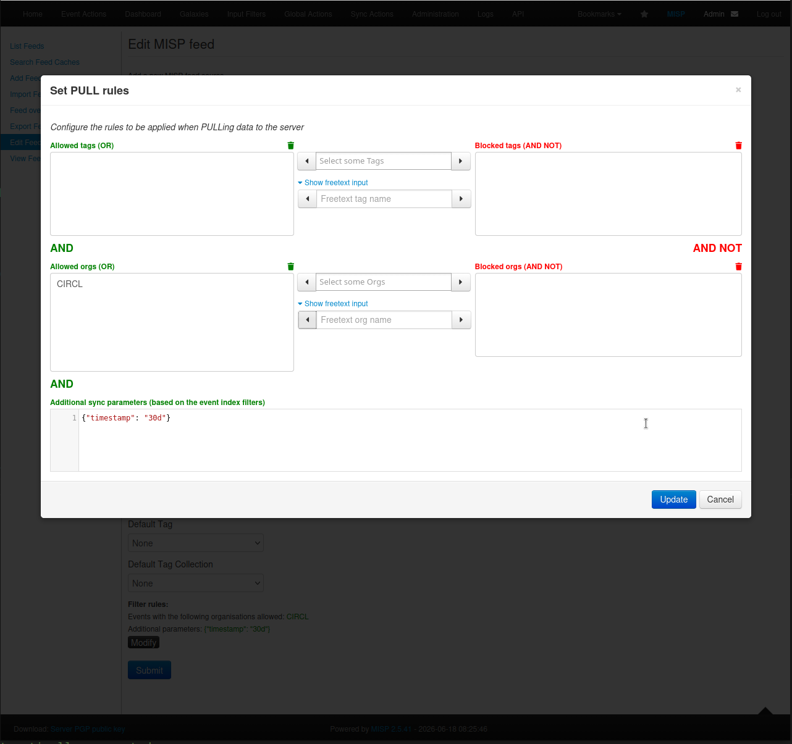
5. Enable _Feed_, caching and lookup and save:

    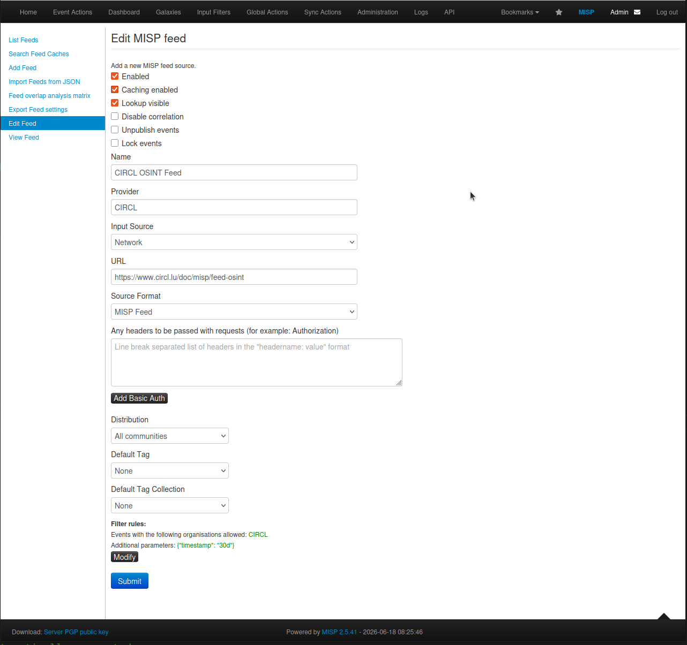
6. Fetch events.

    
7. View events pulled:

    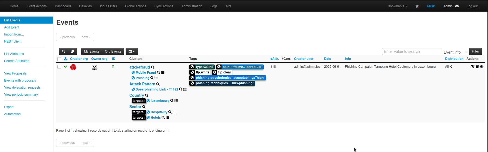

#### 1.4.2 - Schedule a Feed fetch
A manual fetch only imports what is available at that moment. To keep MISP current you
schedule the fetch to run periodically. Depending on your installation, MISP may not be
configured to automatically pull new events.

To verify this, go to `Administration` -> `Scheduled Tasks`

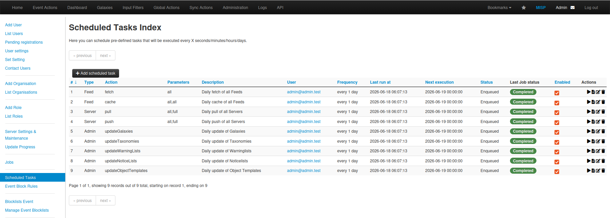

In a standard `misp-docker` installation there are several _Scheduled Tasks_ created, including one to fetch all enabled Feeds.

If you don't see any _Scheduled Task_, you can create one by click on `Add scheduled task`:
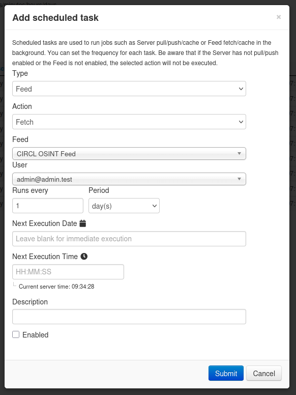

Select `Feed` for the _Type_ of task and _Fetch_ for the action, then you can select one specific _Feed_ or all.

#### 1.5 - Enable new UI 
First, enable the `enable_themes` setting.
```bash
$ docker compose exec misp-core bash
$ sudo -u www-data app/Console/cake admin setSetting MISP.enable_themes 1
```

Enable Overmind UI theme:

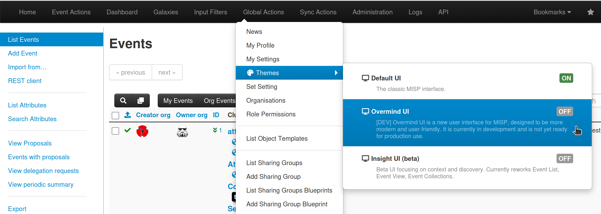

Overmind UI:

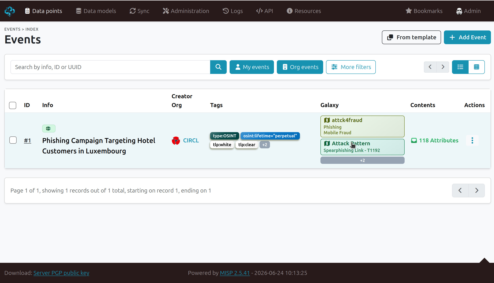

Event view:

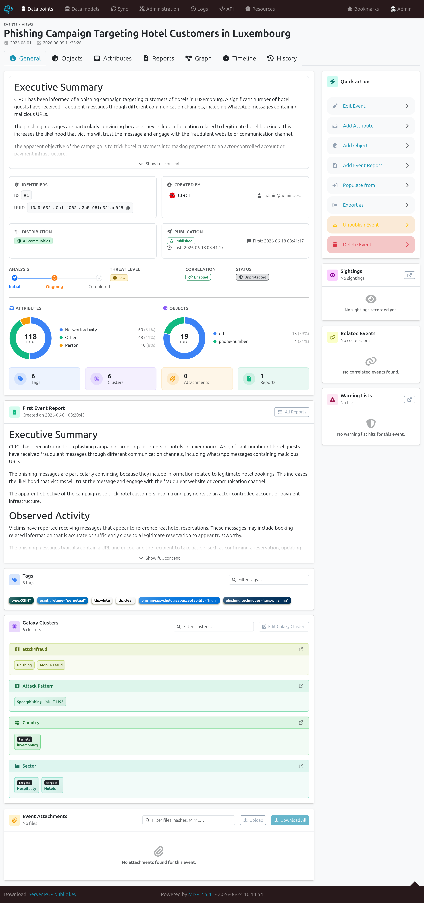

### 1.6 - Adding a MISP Server connection

Beyond feeds, MISP instances can synchronise directly with one another. A **server
connection** lets you **pull** events from a remote instance into yours and/or **push**
your events out to it. This is the standard way trust groups and communities exchange
intelligence between full MISP servers (whereas a feed is one-way and file-based).

Synchronisation is authenticated with an **Auth Key** belonging to a dedicated _sync
user_ on the remote side, and the local organisation you link the connection to
determines whose data is exchanged.

#### 1.6.1 - Create a new Org and a Sync User in the remote MISP Server

Go to `Administration` -> `Add Organisation`

#### 1.6.2 - Create a new MISP Server connection

For the purpose of this lab, the remote MISP instance will be:
* https://training6.misp-community.org


Steps to be done by the remote instance administrator:

1. Create the local Organisation in the remote MISP instance using the `uuid` and organisation name provided by the requester.

2. Add a Sync User in the remote MISP instance
3. Create an Auth Key for the Sync User, share it with the requester.


Steps to be done in our local MISP instance:
1. Go to `Sync Actions` -> `Remote Servers` -> `New Servers`.

    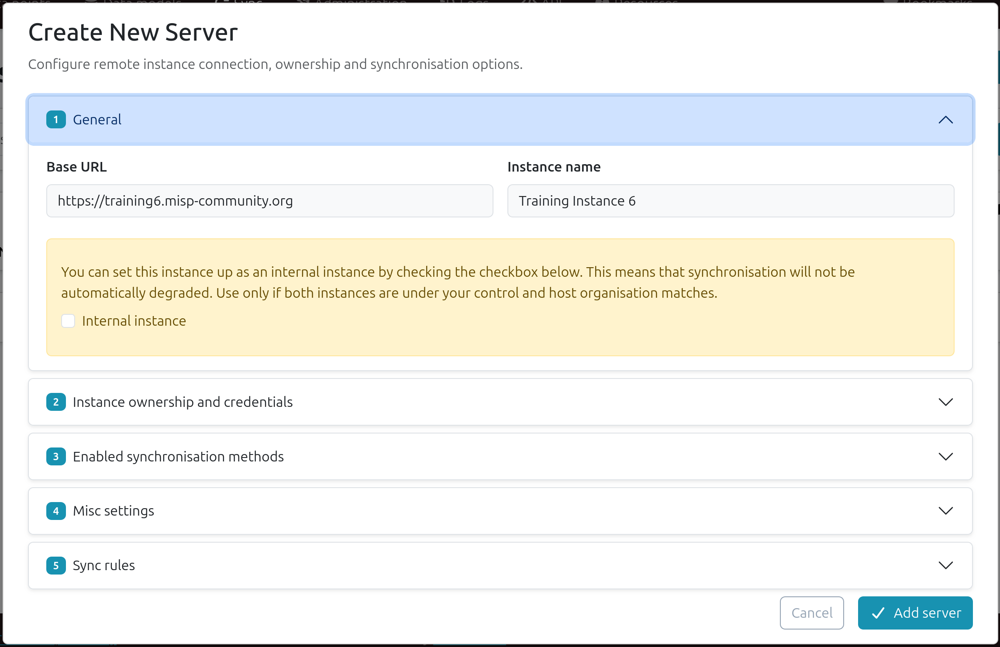

2. Fill the linked Organisation and corresponding Auth Key.

    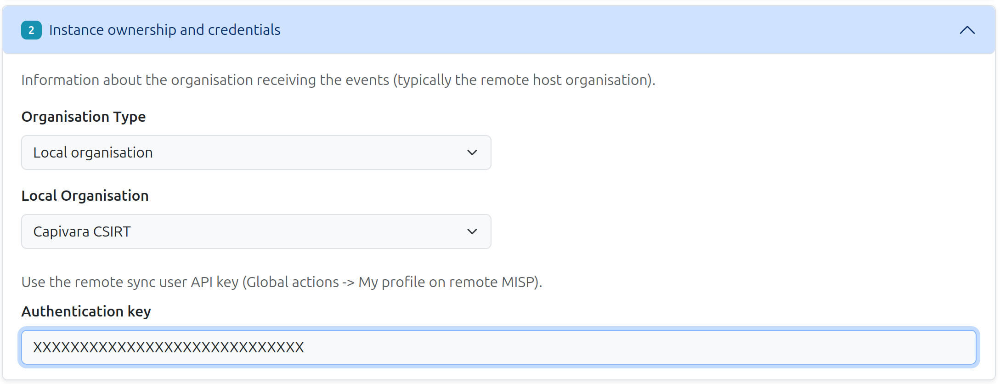

3. Enable the synchronization methods (pull/push).

    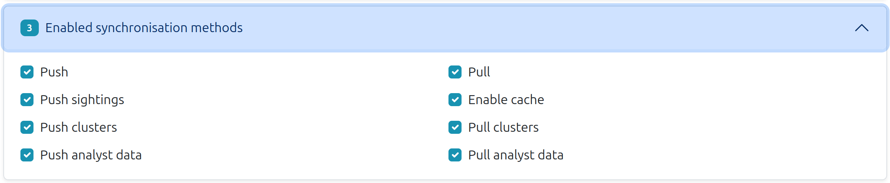

4. Define Sync rules both for pull and push.

    > **Sync rules** filter which events cross the connection, by tag and by organisation.
    > _Push rules_ control what you send to the remote; _pull rules_ control what you
    > accept from it. Empty rules mean "no restriction".

    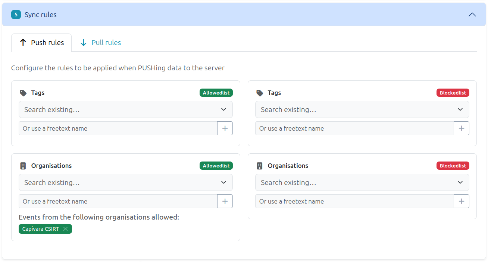
    
    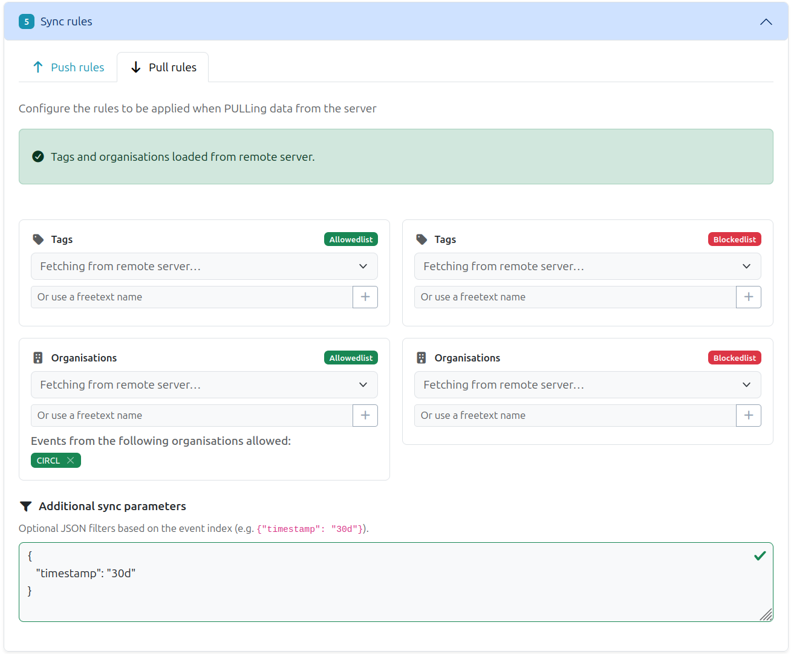

5. Check Server connection status and sync rules.

    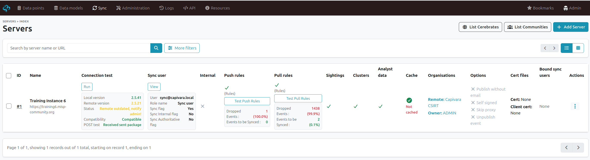

6. Pull events.

    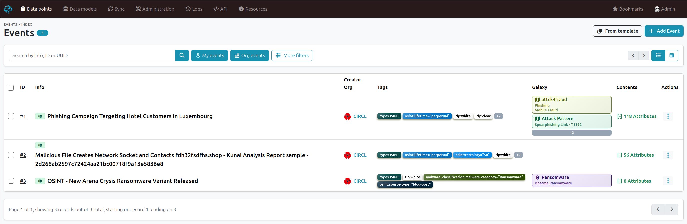

7. For setting up a Scheduled Task to pull/push the server regularly, check section `1.4.2`.


### 1.7 - PyMISP

[PyMISP](https://github.com/MISP/PyMISP) is the official Python client for the MISP REST
API. It lets you script anything you can do in the web UI — searching events, extracting
attributes, creating data — which is how you feed IOCs from MISP into other tools or
automate repetitive tasks. The examples below build up from a connection test to
exporting IOCs as CSV.

#### 1.7.1 - Requirements
* Python 3.12 or newer.
* `venv` (recommended).

#### 1.7.2 - Installation
```bash
$ apt install python3.12-venv
$ python3.12 -m venv .venv
$ source .venv/bin/activate
$ pip3 install pymisp
```


#### 1.7.3 - Create a new API User and an _Auth Key_

Once you have your _Auth Key_, expose it to the scripts through environment variables
instead of hardcoding it. The scripts read `MISP_URL` (defaults to the lab VM at
`https://192.168.56.30`) and `MISP_KEY` (required, no default):

```bash
$ export MISP_KEY="<YOUR_MISP_AUTH_KEY>"
# optional — only if your instance is not the lab default:
$ export MISP_URL="https://<YOUR_MISP_HOST>"
```

> These variables only last for the current shell session. Re-run the `export` commands
> if you open a new terminal, or add them to `~/.bashrc` to make them persistent.
> If `MISP_KEY` is not set, the scripts exit with a reminder to set it.

#### 1.7.4 - `connect.py`

```python
##!/usr/bin/env python3
import os
import pymisp
import urllib3

# this is only required because we are using a local instance with a self-signed certificate
urllib3.disable_warnings(urllib3.exceptions.InsecureRequestWarning)

# Read the connection details from environment variables (see step 1.7.3).
MISP_URL = os.getenv("MISP_URL", "https://192.168.56.30")
MISP_KEY = os.getenv("MISP_KEY")
if not MISP_KEY:
    raise SystemExit(
        "Please set the MISP_KEY environment variable, e.g.:\n"
        '  export MISP_KEY="your-api-key-here"'
    )

misp = pymisp.PyMISP(
    MISP_URL,
    MISP_KEY,
    ssl=False # Disable SSL verification
)
print(f"Connected to MISP instance version: {misp._misp_version}")
```

Run the `connect.py` script:
```bash
$ python connect.py 
Connected to MISP instance version: (2, 5, 42)
```

#### 1.7.5 - `get_events.py`

```python
##!/usr/bin/env python3
import os
import pymisp
import urllib3

# this is only required because we are using a local instance with a self-signed certificate
urllib3.disable_warnings(urllib3.exceptions.InsecureRequestWarning)

# Read the connection details from environment variables (see step 1.7.3).
MISP_URL = os.getenv("MISP_URL", "https://192.168.56.30")
MISP_KEY = os.getenv("MISP_KEY")
if not MISP_KEY:
    raise SystemExit(
        "Please set the MISP_KEY environment variable, e.g.:\n"
        '  export MISP_KEY="your-api-key-here"'
    )

misp = pymisp.PyMISP(
    MISP_URL,
    MISP_KEY,
    ssl=False # Disable SSL verification
)

# /events/restSearch
events = misp.search(
    "events",
    # tags=["tlp:white", "tlp:clear"],
    limit=10,
    pythonify=True,
)
for event in events:
    print(f"Event UUID: {event.uuid}")
    print(f"Info: {event.info}")
    print(f"Date: {event.date}")
    print("" + "-" * 40)
```

Sample results:

```
$ python get_events.py 
Event UUID: 5141a946-6109-4a37-821e-83eb8a281e2f
Info: Maltrail IOC for 2026-06-15
Date: 2026-06-14
----------------------------------------
Event UUID: a569ecc1-9e0d-413a-bb85-50ada5e643c2
Info: Maltrail IOC for 2026-06-10
Date: 2026-06-09
----------------------------------------
Event UUID: 9a4ef3c0-d447-4f61-b72c-46d3acbbb1d2
Info: Maltrail IOC for 2026-05-27
Date: 2026-05-26
----------------------------------------
Event UUID: a03acbf1-881f-4cb3-884b-360fa93e141e
Info: Maltrail IOC for 2026-05-29
Date: 2026-05-28
----------------------------------------
Event UUID: 48f67453-ca57-4770-8c63-dc82595f3e0e
Info: Maltrail IOC for 2026-05-31
Date: 2026-05-30
----------------------------------------
Event UUID: 10a94632-a0a1-4062-a3a5-95fe321ae045
Info: Phishing Campaign Targeting Hotel Customers in Luxembourg
Date: 2026-06-01
----------------------------------------

```

#### 1.7.6 - `get_iocs.py`

> `to_ids=True` returns only attributes flagged as actionable detection indicators — the
> ones meant to be exported to security tools — filtering out purely contextual or
> known-benign values. This is the same flag Wazuh relies on later in the integration.

```python
##!/usr/bin/env python3
import os
import pymisp
import urllib3

# this is only required because we are using a local instance with a self-signed certificate
urllib3.disable_warnings(urllib3.exceptions.InsecureRequestWarning)

# Read the connection details from environment variables (see step 1.7.3).
MISP_URL = os.getenv("MISP_URL", "https://192.168.56.30")
MISP_KEY = os.getenv("MISP_KEY")
if not MISP_KEY:
    raise SystemExit(
        "Please set the MISP_KEY environment variable, e.g.:\n"
        '  export MISP_KEY="your-api-key-here"'
    )

misp = pymisp.PyMISP(
    MISP_URL,
    MISP_KEY,
    ssl=False # Disable SSL verification
)

# /attributes/restSearch
attributes = misp.search(
    "attributes",
    # tags=["tlp:white", "tlp:clear"],
    type_attribute=["ip-src", "ip-dst"],
    to_ids=True,
    pythonify=True,
    limit=5,
)
for attribute in attributes:
    print(f"Attribute UUID: {attribute.uuid}")
    print(f"Type: {attribute.type}")
    print(f"Value: {attribute.value}")
    print("" + "-" * 40)
```

Sample results:

```
$ python get_iocs.py 
Attribute UUID: 62b1ead6-df88-41a6-bb22-5baa23a68701
Type: ip-dst
Value: 146.103.116.11
----------------------------------------
Attribute UUID: 5d41a3ed-13d0-4f92-a4fe-5fc62b3e30a4
Type: ip-dst
Value: 2.24.131.246
----------------------------------------
Attribute UUID: e72aae64-b116-45f4-bf6f-88a88fe2b4c0
Type: ip-dst
Value: 212.43.156.47
----------------------------------------
Attribute UUID: aca4bfca-d201-45dc-844e-d18a0b514c43
Type: ip-dst
Value: 46.151.26.137
----------------------------------------
Attribute UUID: 44b549eb-b107-4cbe-910d-b55c86f8d8e8
Type: ip-dst
Value: 45.144.222.126
----------------------------------------

```

#### 1.7.7 - `get_iocs_csv.py`

```python
##!/usr/bin/env python3
import os
import pymisp
import urllib3

# this is only required because we are using a local instance with a self-signed certificate
urllib3.disable_warnings(urllib3.exceptions.InsecureRequestWarning)

# Read the connection details from environment variables (see step 1.7.3).
MISP_URL = os.getenv("MISP_URL", "https://192.168.56.30")
MISP_KEY = os.getenv("MISP_KEY")
if not MISP_KEY:
    raise SystemExit(
        "Please set the MISP_KEY environment variable, e.g.:\n"
        '  export MISP_KEY="your-api-key-here"'
    )

misp = pymisp.PyMISP(
    MISP_URL,
    MISP_KEY,
    ssl=False # Disable SSL verification
)

# IPs CSV - using direct API call to /attributes/restSearch endpoint
# Paginate through all results, fetching one page at a time until a page
# comes back empty.
page_size = 1000
page = 1
all_ips = []

while True:
    ips = misp.direct_call(
        "/attributes/restSearch",
        {
            "type": ["ip-src", "ip-dst", "ip"],  # Filter for the ip attributes
            # tags=["tlp:white", "tlp:clear"],
            "to_ids": True,
            "returnFormat": "csv",  # Request the response in CSV format
            "requested_attributes": [
                "value"
            ],  # Only request the 'value' field (IP addresses)
            "headerless": True,  # No CSV headers
            "limit": page_size,  # Number of results per page
            "page": page,  # Current page number
        },
    )

    # CSV return format gives us a string; split into non-empty lines.
    lines = [line for line in ips.splitlines() if line.strip()]
    if not lines:
        break  # No more results

    all_ips.extend(lines)

    if len(lines) < page_size:
        break  # Last (partial) page reached

    page += 1

print("\n".join(all_ips))
```

Sample results:
```bash
$ python get_iocs_csv.py 
"146.103.116.11"
"2.24.131.246"
"212.43.156.47"
"46.151.26.137"
"45.144.222.126"
"107.173.87.138"
"156.248.73.63"
"206.119.172.161"
"31.76.118.178"
"46.21.250.94"
```

### 1.8 - MISP Modules / Enrichments

**Enrichment modules** let MISP query external services to add context to an attribute on
demand — for example resolving an IP's historical DNS records (`circl_passivedns`) or
checking whether a file hash is already known (`hashlookup`). The modules run in a
separate `misp-modules` container, so before using them we confirm MISP can reach that
service.

1. Go to `Administration` -> `Server Settings & Maintenance` -> `Diagnostics` tab.

    Or go to the URL: `/servers/serverSettings/diagnostics`

    Check the _Module System_ is configured properly:

    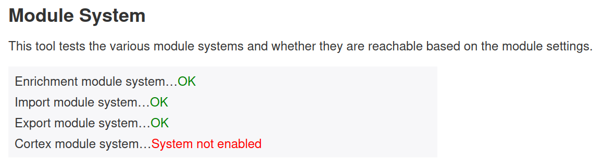


2. Enable and configure `circl_passivedns` and `hashlookup` modules.

3. Create a new event, add a new attribute with the value `185.194.93.14` and type `ip-src`.

4. Enrich the attribute and add the `passive-dns` objects.

    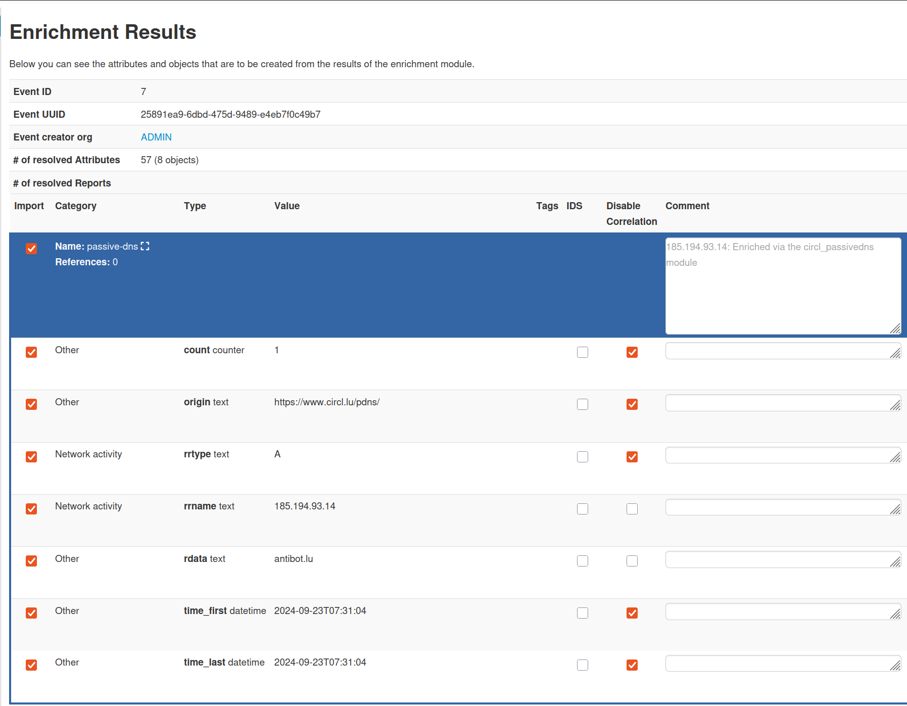


5. Get the md5 checksum of /usr/bin/netcat, add it to the event and enrich the attribute with the `hashlookup` module.
 
     ```
     $ md5sum /usr/bin/netcat 
    aaade8e2a921e9ac40178a263ebb67e3  /usr/bin/netcat
     ```
 
    * https://hashlookup.circl.lu/lookup/md5/aaade8e2a921e9ac40178a263ebb67e3

    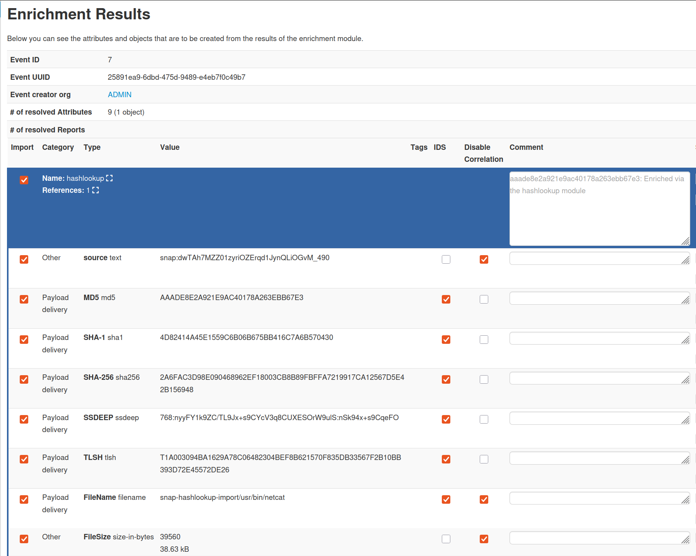

Examples of other useful enrichment modules are:
* Shodan
* VirusTotal
* Censys
* More info: github.com/MISP/misp-modules

## 2 - Wazuh

[Wazuh](https://wazuh.com) collects security telemetry from your hosts and evaluates it
against **rules** to produce **alerts**. It has three main pieces:

* **Wazuh Agent** — runs on each monitored host, collecting log, file-integrity and
  system data and shipping it to the manager.
* **Wazuh Manager** — receives agent data, _decodes_ it into fields, and runs the
  detection rules that generate alerts.
* **Wazuh Indexer & Dashboard** — store and visualise alerts (the web UI you log into).

In this lab the manager, indexer and dashboard all run on the `wazuh-manager` VM, with a
single agent on `wazuh-agent-01`.

### 2.1 - Access Wazuh Dashboard

With the pre-configured `wazuh-manager` VM running, connect to it via SSH:

```
user: wazuh-user
password: wazuh
```

```
$ ssh wazuh-user@192.168.56.10
The authenticity of host '192.168.56.10 (192.168.56.10)' can't be established.
ECDSA key fingerprint is SHA256:6UYQItNyjqrc0FlFMeidlHkcYQCges2aiCCNttgM+Fs.
This key is not known by any other names.
Are you sure you want to continue connecting (yes/no/[fingerprint])? yes
Warning: Permanently added '192.168.56.10' (ECDSA) to the list of known hosts.
wazuh-user@192.168.56.10's password: 

A newer release of "Amazon Linux" is available.
  Version 2023.11.20260427:
  Version 2023.11.20260505:
  Version 2023.11.20260509:
  Version 2023.11.20260511:
  Version 2023.11.20260514:
  Version 2023.11.20260526:
  Version 2023.12.20260608:
  Version 2023.12.20260611:
  Version 2023.12.20260622:
Run "/usr/bin/dnf check-release-update" for full release and version update info
wwwwww.           wwwwwww.          wwwwwww.
wwwwwww.          wwwwwww.          wwwwwww.
 wwwwww.         wwwwwwwww.        wwwwwww.
 wwwwwww.        wwwwwwwww.        wwwwwww.
  wwwwww.       wwwwwwwwwww.      wwwwwww.
  wwwwwww.      wwwwwwwwwww.      wwwwwww.
   wwwwww.     wwwwww.wwwwww.    wwwwwww.
   wwwwwww.    wwwww. wwwwww.    wwwwwww.
    wwwwww.   wwwwww.  wwwwww.  wwwwwww.
    wwwwwww.  wwwww.   wwwwww.  wwwwwww.
     wwwwww. wwwwww.    wwwwww.wwwwwww.
     wwwwwww.wwwww.     wwwwww.wwwwwww.
      wwwwwwwwwwww.      wwwwwwwwwwww.
      wwwwwwwwwww.       wwwwwwwwwwww.      oooooo
       wwwwwwwwww.        wwwwwwwwww.      oooooooo
       wwwwwwwww.         wwwwwwwwww.     oooooooooo
        wwwwwwww.          wwwwwwww.      oooooooooo
        wwwwwww.           wwwwwwww.       oooooooo
         wwwwww.            wwwwww.         oooooo


         WAZUH Open Source Security Platform
                  https://wazuh.com
Last login: Thu Jun 25 12:33:33 2026
[wazuh-user@wazuh-server ~]$ 
```


```
URL: https://192.168.56.10
user: admin
password: admin
```

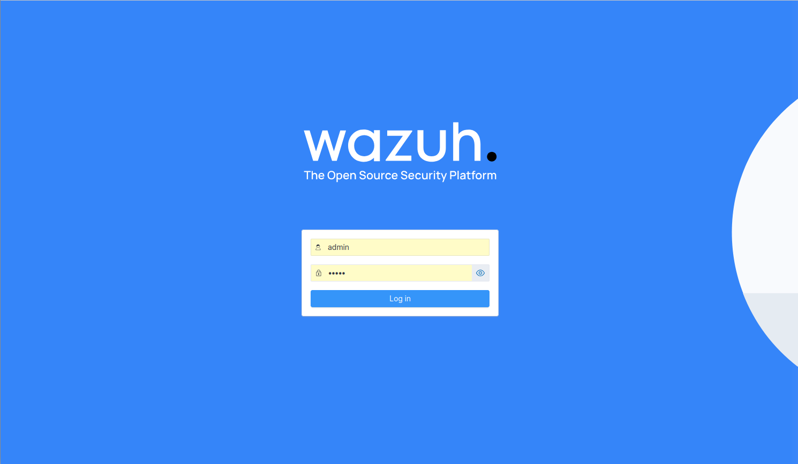


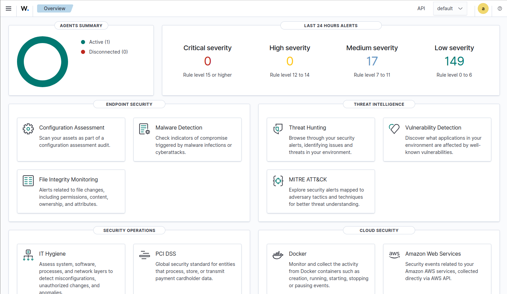

### 2.2 - Monitored Ubuntu Server host

The pre-configured `wazuh-agent-01` VM already has the _Wazuh Agent_ installed and
pointed at the _Wazuh Manager_ (`192.168.56.10`). Just import and start it.

> To change the IP address of the _Wazuh Manager_ after the agent installation, edit the `/var/ossec/etc/ossec.conf` configuration file.

You can log into it via ssh if you need to inspect it:
```bash
# ssh root@192.168.56.20
...
root@wazuh-agent-01:~#
```

### 2.3 - Wazuh <-> MISP integration
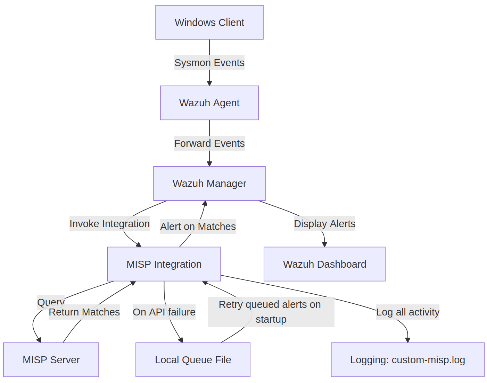
* Source: https://github.com/wazuh/integrations/tree/main/integrations/misp

> The MISP integration script (`custom-misp.py`) comes pre-installed on the
> `wazuh-manager` VM. See [INSTALLATION.md](INSTALLATION.md) section 4 if you need to
> install it manually.

**How the integration works:** when the manager produces an alert whose rule group
matches the integration's `<group>` filter, it hands the alert to the `custom-misp.py`
script. The script extracts any IOC (hash, IP or domain) from the alert and queries the
MISP REST API. If MISP returns a matching attribute, the script injects a new event back
into Wazuh, which a dedicated rule turns into a high-severity _"IoC found"_ alert. So
Wazuh detects the activity, and MISP decides whether that activity is known-malicious.

Test connectivity from Wazuh to MISP, from the SSH session in the Wazuh VM, run:
```bash
[wazuh-user@wazuh-server ~]$ curl -k -s -X GET https://<YOUR_MISP_HOST>/attributes/restSearch/value:test -H 'Content-Type: application/json' -H 'Authorization: <YOUR_MISP_AUTH_KEY>' -H 'Accept: application/json'
{"response": {"Attribute": []}}
```

> The JSON response means we can query our MISP instance and our _Auth Key_ is valid.

We can check in Wazuh Dashboard that the agent is connected:

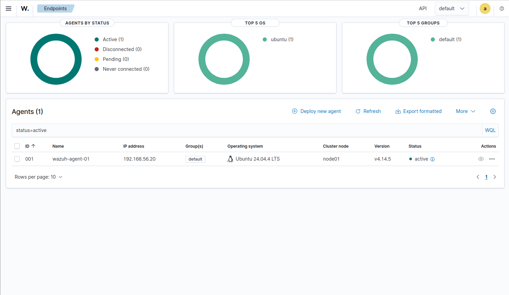

#### Monitor host malicious file hashes (FIM checks)

**File Integrity Monitoring (FIM)** — Wazuh's `syscheck` feature — watches chosen
directories and reports whenever a file is created, modified or deleted, including its
hashes. Here we route those FIM alerts to the MISP integration so every new file's hash
is automatically checked against MISP threat intel.

Add the MISP integration configuration block to the Wazuh Manager configuration file. The
`<group>` element acts as a filter: only alerts tagged with that group are forwarded to
the script, so we set it to `syscheck` to avoid pointless MISP lookups for unrelated
events.
```bash
vim /var/ossec/etc/ossec.conf
```

```xml
<ossec_config>
    <integration>
    <name>custom-misp.py</name>
    <group>syscheck</group>
    <hook_url>https://YOUR_MISP_IP:PORT/</hook_url>
    <api_key>YOUR_API_KEY</api_key>
    <alert_format>json</alert_format>
    </integration>
</ossec_config>
```

Restart Wazuh Manager:
```bash
$ sudo systemctl restart wazuh-manager
```

Add custom MISP rules:

Go to _Server Management_ -> _Rules_ > _Add New Rule file_. Name it `custom_misp_rules.xml`

```xml
<group name="misp,">
  <rule id="100620" level="10">
    <decoded_as>json</decoded_as>
    <field name="integration">misp</field>
    <description>Default rule for MISP Events</description>
    <!--options>no_full_log</options-->
  </rule>
  <rule id="100621" level="12">
    <if_sid>100620</if_sid>
    <field name="threat">MISP error</field>
    <description>MISP error</description>
  </rule>
  <rule id="100623" level="12">
    <if_sid>100620</if_sid>
    <field name="ioc.sha256">\.+</field>
    <description>MISP - IoC found in Threat Intel - Attribute: hash $(ioc.sha256) - Event: $(misp_response.sha256.event_info)</description>
  </rule>
  <rule id="100624" level="12">
    <if_sid>100620</if_sid>
    <field name="ioc.sha1">\.+</field>
    <description>MISP - IoC found in Threat Intel - Attribute: hash $(ioc.sha1) - Event: $(misp_response.sha1.event_info)</description>
  </rule>
</group>
```

Save and reload the new rule.

> **About Wazuh rules:** every rule has a numeric `id` and a `level` (0–15) that ranks
> severity. The rules above fire at level 12 so that confirmed IoC matches stand out from
> routine noise. `<if_sid>` chains a rule to a parent (here, all MISP rules build on
> `100620`), and the `$(field)` placeholders pull values out of the MISP response into the
> alert description. Custom rule IDs should stay in the user range (100000+).

Now configure our Wazuh Agent to monitor a filesystem directory:
we need to configure our Wazuh agents to enable filesystem monitoring on the directories we are interested in.

On Ubuntu the agent configuration file is usually located in `/var/ossec/etc/ossec.conf`.

We can instruct the Wazuh agent to monitor a directory using the `<directories>` configuration block as follows:

```xml
<ossec_config>
  <syscheck>
    <disabled>no</disabled>
    <directories check_all="yes" realtime="yes">MONITORED_DIRECTORY_PATH</directories>
  </syscheck>
</ossec_config>
```

> `check_all` allows checks of the file size, permissions, owner, last modification date, inode, and the hash sums (MD5, SHA1, and SHA256).

When a new file is added to the monitored directory, Wazuh generates an alert (`ID 554`) containing file metadata such as hashes, file size, name, and permissions.

>
> After making changes to the `ossec.conf` file, restart the Wazuh agent to apply the configuration changes.
> 
> `systemctl restart wazuh-agent`


Now, create a file in the monitored directory and you should see an `ID 554` on the Wazuh Threat Hunting dashboard.

To trigger a positive match in MISP, add any of the `eicar.com` hashes to your MISP instance and publish the event.

* **MD5:** `44d88612fea8a8f36de82e1278abb02f`
* **SHA1:** `3395856ce81f2b7382dee72602f798b642f14140`
* **SHA256**: `275a021bbfb6489e54d471899f7db9d1663fc695ec2fe2a2c4538aabf651fd0f`

> Make sure the event containing the hashes is visible to the user associated with the API AuthKey, otherwise no match will occur.

Inside the monitored host, download [eicar.com](https://secure.eicar.org/eicar.com) file to the monitored directory.

```bash
curl -Lo /tmp/malicious-file.exe https://secure.eicar.org/eicar.com
```

If we go to the _Threat intelligence_ → _Threat Hunting_ → _Events_ panel in Wazuh, a rule `ID 550` and `ID 100623` should be created.

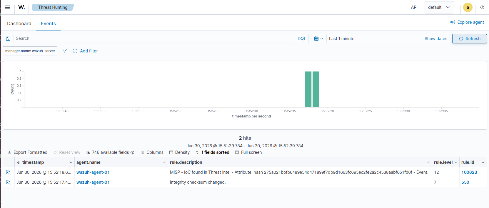

Done!


#### Debugging

Check Wazuh MISP integration logs:
```
[root@wazuh-server wazuh-user]# tail -f /var/log/wazuh-misp/integrations.log
2026-07-24 13:54:43,806 [INFO] wazuh-misp-integration: MISP match found for IOC value '275a021bbfb6489e54d471899f7db9d1663fc695ec2fe2a2c4538aabf651fd0f'
2026-07-24 13:54:43,806 [INFO] wazuh-misp-integration: MISP match found for IOC value '44d88612fea8a8f36de82e1278abb02f'
2026-07-24 13:54:43,806 [INFO] wazuh-misp-integration: Sent enriched event to Wazuh socket
2026-07-24 13:54:44,278 [INFO] wazuh-misp-integration: MISP query successful for '44d88612fea8a8f36de82e1278abb02f', status 200
2026-07-24 13:54:44,309 [INFO] wazuh-misp-integration: MISP query successful for '3395856ce81f2b7382dee72602f798b642f14140', status 200
```


### Suricata - Monitor network IOCs

FIM only sees files on disk. To catch malicious **network** activity — connections to
known-bad IPs or lookups of known-bad domains — we need something that inspects traffic.
[Suricata](https://suricata.io) is an IDS that logs DNS, HTTP, TLS and connection events
to a JSON file (`eve.json`). We ship that log to the Wazuh Agent so the same MISP lookup
flow can run against the IPs and domains Suricata observes.

Install Suricata on the Wazuh Agent VM:

```bash
ssh root@192.168.56.20
sudo apt update
sudo apt install suricata -y
sudo systemctl stop suricata        # stop it while we configure
```

Get the proper interface name to monitor:
```bash
# ip route get 8.8.8.8
8.8.8.8 via 10.0.2.2 dev enp0s3 src 10.0.2.15 uid 0 
    cache 
```

Edit `/etc/suricata/suricata.yaml`:

```
$ vim /etc/suricata/suricata.yaml
```

Set the correct interface:
```yaml
af-packet:
  - interface: enp0s3        # match your egress iface from ip route get
```

Make sure the eve-log section emits dns, http, and alert events (these carry your IP/domain IOCs):
```yaml
outputs:
  - eve-log:
      enabled: yes
      filename: eve.json
      types:
        - alert
        - dns
        - http
        - tls
        - flow
```

Get rules and start Suricata:
```bash
sudo suricata-update              # pulls the ET Open ruleset
sudo systemctl enable --now suricata
sudo systemctl status suricata --no-pager
```

Confirm it's writing events:
```bash
sudo tail -f /var/log/suricata/eve.json
# in another session: curl -s http://example.com > /dev/null
# you should see dns and http/flow JSON lines appear with dest_ip and hostnames
```

Now feed eve.json to the Wazuh Agent. Add a localfile block to the agent's ossec.conf. Suricata's eve.json is JSON, so use json format:

```
sudo nano /var/ossec/etc/ossec.conf
```

```xml
<ossec_config>
  <localfile>
    <log_format>json</log_format>
    <location>/var/log/suricata/eve.json</location>
  </localfile>
</ossec_config>
```

Restart Wazuh Agent:
```bash
sudo systemctl restart wazuh-agent
```

Trigger traffic on the agent, then inspect a Suricata alert's JSON:
```bash
sudo tail -f /var/ossec/logs/alerts/alerts.json
```

Wazuh decodes Suricata eve.json into data.* fields. You'll typically see destination IPs at _data.dest_ip_ (and _data.src_ip_), DNS names at _data.dns_.rrname, HTTP hosts at data.http.hostname, TLS SNI at _data.tls.sni_. These are nested, which matters for the script.
Here's the key adjustment. The MISP script's **SUPPORTED_KEYS** traverses dotted paths under data, but its current candidates don't include Suricata's nested names.

Add them on the manager in `/var/ossec/integrations/custom-misp.py`:
```python
SUPPORTED_KEYS = [
    ("ip_src", ["src_ip", "source_ip", "srcip", "SourceIP", "aws.source_ip_address", "client_ip", "clientIP_s", "IPAddress", "originalHost_s", "CallerIPAddress"]),
    ("ip_dst", ["dst_ip", "destination_ip", "dstip", "DestinationIP", "remote_ip", "external_ip", "dest_ip"]),
    ("sha1",   ["sha1", "sha1sum", "file_sha1", "ciscoendpoint.file.identity.sha1"]),
    ("sha256", ["sha256", "sha256sum", "file_sha256", "ciscoendpoint.file.identity.sha256"]),
    ("md5",    ["md5", "md5sum", "file_md5", "ciscoendpoint.file.identity.md5"]),
    ("url",    ["url", "source_url", "TargetURL", "download_url", "http_url", "http.url"]),
    ("domain", ["domain", "hostname", "base_domain", "fqdn", "TargetDestination", "Fqdn_s", "win.eventdata.queryName", "dns.rrname", "http.hostname", "tls.sni"]),
]
```

Extend `custom_misp_rules.xml` rules files in Wazuh:

```xml
<group name="suricata,">
  <rule id="100710" level="3">
    <if_sid>86603</if_sid>
    <field name="dns.rrname">\.+</field>
    <description>Suricata DNS query - $(dns.rrname)</description>
    <options>no_full_log</options>
    <group>suricata_dns,</group>
  </rule>
  <rule id="100711" level="3">
    <if_sid>86600</if_sid>
    <field name="dest_ip">\.+</field>
    <description>Suricata connection - dst $(dest_ip)</description>
    <options>no_full_log</options>
    <group>suricata_conn,</group>
  </rule>
</group>

<group name="misp,">
  <rule id="100620" level="10">
    <decoded_as>json</decoded_as>
    <field name="integration">misp</field>
    <description>Default rule for MISP Events</description>
    <!--options>no_full_log</options-->
  </rule>
  <rule id="100621" level="12">
    <if_sid>100620</if_sid>
    <field name="threat">MISP error</field>
    <description>MISP error</description>
  </rule>
  <rule id="100622" level="12">
    <if_sid>100620</if_sid>
    <field name="ioc.domain">\.+</field>
    <description>MISP - IoC found in Threat Intel - Attribute: host $(ioc.domain) - Event: $(misp_response.domain.event_info)</description>
  </rule>
  <rule id="100623" level="12">
    <if_sid>100620</if_sid>
    <field name="ioc.sha256">\.+</field>
    <description>MISP - IoC found in Threat Intel - Attribute: hash $(ioc.sha256) - Event: $(misp_response.sha256.event_info)</description>
  </rule>
  <rule id="100624" level="12">
    <if_sid>100620</if_sid>
    <field name="ioc.sha1">\.+</field>
    <description>MISP - IoC found in Threat Intel - Attribute: hash $(ioc.sha1) - Event: $(misp_response.sha1.event_info)</description>
  </rule>
  <rule id="100625" level="12">
    <if_sid>100620</if_sid>
    <field name="ioc.ip_dst">\.+</field>
    <description>MISP - IoC found in Threat Intel - Attribute: ip-dst $(ioc.ip_dst) - Event: $(misp_response.ip_dst.event_info)</description>
  </rule>
  <rule id="100626" level="12">
    <if_sid>100620</if_sid>
    <field name="ioc.ip_src">\.+</field>
    <description>MISP - IoC found in Threat Intel - Attribute: ip-src $(ioc.ip_src) - Event: $(misp_response.ip_src.event_info)</description>
  </rule>
</group>
```

Update the integration configuration in Wazuh Manager to process these new groups:

```vim /var/ossec/etc/ossec.conf```

```xml
<ossec_config>
  <integration>
    <name>custom-misp.py</name>
    <group>suricata_conn,suricata_dns,syscheck</group>
    <hook_url>https://192.168.56.30/</hook_url>
    <api_key>YOUR_MISP_AUTH_KEY</api_key>
    <alert_format>json</alert_format>
  </integration>
</ossec_config>
```

Restart Wazuh manager:
```bash
$ systemctl restart wazuh-manager
```

Done!

Add a MISP Event with some network IOCs, for example an attribute of type domain `circl.lu`, and `185.194.93.14`. Check `To IDS` and publish the event.

To test a malicious domain alert run inside the Wazuh Agent:
```bash
# dig @8.8.8.8 circl.lu
```

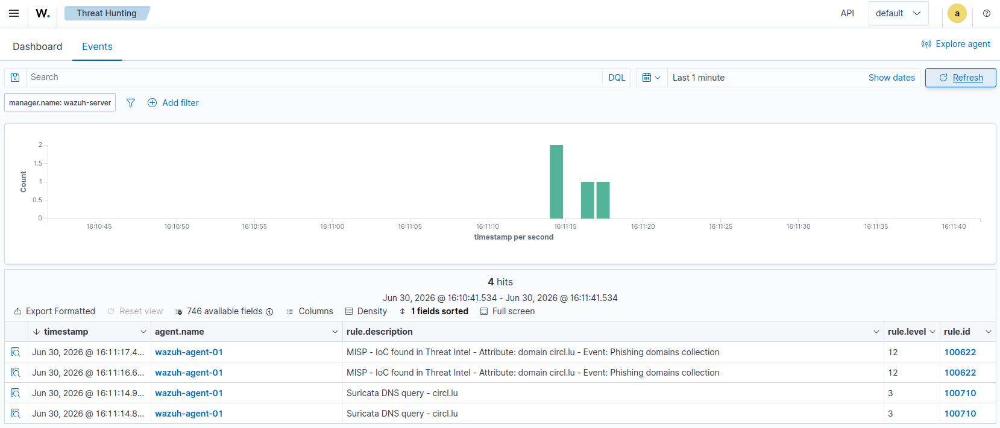


To test a malicious IP run inside the Wazuh Agent:
```bash
curl -s https://circl.lu > /dev/null
```

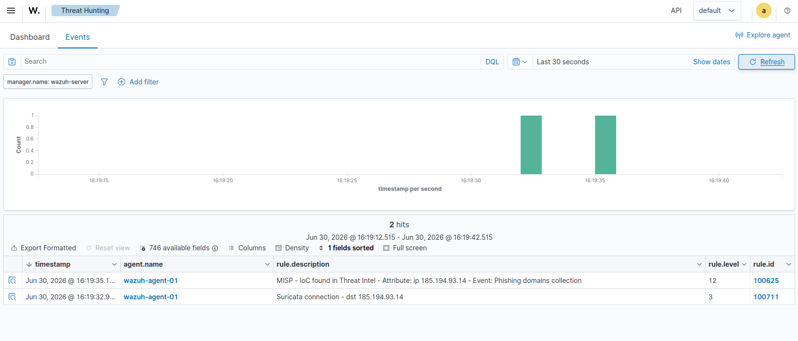


Additionally, you can leverage Wazuh _Active Response_ module to act on this alert and automatically delete or run additional actions. Read more about this [here](https://documentation.wazuh.com/current/user-manual/capabilities/active-response/index.html) and check [this tutorial](https://wazuh.com/blog/detecting-and-responding-to-malicious-files-using-cdb-lists-and-active-response/). 


### Zeek - Monitor network IOCs

Suricata (above) ships every DNS/HTTP/flow record to the Wazuh Agent and lets the manager
run a MISP lookup per event. [Zeek](https://zeek.org) takes the opposite approach: with its
**Intelligence Framework** and the `zeekjs-misp` plugin it pulls the IOCs out of MISP
*once*, holds them in memory, and matches them against live traffic itself — writing a line
to `intel.log` only when traffic actually hits one. That means far less load on MISP (one
periodic bulk fetch instead of a query per event), which is the same pull model the scaling
section (§3.3) recommends. We then ship the much smaller `intel.log` to the Wazuh Agent for
alerting.

> This section assumes Zeek and the `zeekjs-misp` plugin are already installed on the Wazuh
> Agent VM — see [INSTALLATION.md](INSTALLATION.md).

**Point Zeek at MISP**

The Wazuh decoder below parses Zeek's TSV logs, so JSON logging must stay off. Edit the
site policy:

```bash
vim /opt/zeek/share/zeek/site/local.zeek
```

```
@load zeekjs-misp
@load frameworks/intel/seen

redef LogAscii::use_json = F;                    # keep logs in TSV, not JSON
redef ignore_checksums = T;                      # VMs offload checksums; without this Zeek
                                                 # drops egress packets as "bad" (history 'C')
                                                 # and never matches IOCs
redef MISP::url = "https://192.168.56.30";
redef MISP::api_key = "YOUR_MISP_AUTH_KEY";
redef MISP::insecure = T;                        # lab MISP uses a self-signed cert
redef MISP::debug = T;
redef MISP::attributes_search_tags = {"zeek:ingest"};
```

> As with Suricata's `suricata:ingest`, tag the MISP attributes you want Zeek to enforce
> with `zeek:ingest` so the pull stays a deliberate subset rather than every IOC in the
> platform.

> **VM checksum offloading.** On a VM the NIC fills in TCP/IP checksums *after* Zeek sees the
> packet, so captured egress traffic looks corrupt — `conn.log` shows a `conn_state` of `OTH`
> or `SHR` and a `C` in the `history` field. Zeek then never fires `connection_established`,
> so the Intel framework never checks the connection and `intel.log` stays empty even though
> the IOC is loaded. `redef ignore_checksums = T;` above fixes it. Also make sure Zeek sniffs
> the **egress/NAT interface** (the one carrying the `10.0.2.x` traffic), since connections to
> external bad IPs leave that way — not the host-only lab interface.

Check the configuration, then deploy (this compiles the config and starts Zeek):

```bash
  $ /opt/zeek/bin/zeekctl check
  zeek scripts are ok.
```

```bash
   $ /opt/zeek/bin/zeekctl deploy
  checking configurations ...
  installing ...
  creating policy directories ...
  installing site policies ...
  generating standalone-layout.zeek ...
  generating local-networks.zeek ...
  generating zeekctl-config.zeek ...
  generating zeekctl-config.sh ...
  stopping ...
  stopping zeek ...
  starting ...
  starting zeek ...
```

Confirm Zeek loaded the IOCs from MISP (logged because `MISP::debug = T`):
```
$ head -n 40 /opt/zeek/logs/current/stdout.log 
max memory size             (kbytes, -m) unlimited
data seg size               (kbytes, -d) unlimited
virtual memory              (kbytes, -v) unlimited
core file size              (blocks, -c) unlimited
zeek-misp: Starting up zeekjs-misp
zeek-misp: url https://192.168.56.30
zeek-misp: api_key LHjs...
zeek-misp: refresh_interval 120000
zeek-misp: max_item_sightings 5n
zeek-misp: max_item_sightings_interval 5000
zeek-misp: Schedule for 120000...
zeek-misp: Loading intel data through attributes search
zeek-misp: Attribute search {"tags":["zeek:ingest"],"to_ids":1,"eventid":[],"type":"!yara,!malware-sample,!ssdeep,!pattern-in-traffic,!btc","from":1752172959}
zeek-misp: searchAttributes done items=9140 requestMs=1088.5019226074219ms insertMs=577.0161972045898ms
zeek-misp: Summary of attribute types
zeek-misp:   ip-dst = 9140
zeek-misp: Attributes search done
zeek-misp: Schedule for 120000...
```

```bash
$ /opt/zeek/bin/zeekctl status 
```


**Verify Zeek matches an IOC**

Trigger a connection to an IP that is in MISP (here, a Tor exit node):
```bash
$ nc -z -v 185.194.93.14 80
Connection to 185.194.93.14 80 port [tcp/http] succeeded!
```

With `MISP::debug = T` the match is also visible in `stdout.log`:
```
$ tail /opt/zeek/logs/current/stdout.log 
zeek-misp: zeek-misp: Intel::match 185.194.93.14
zeek-misp: Sightings reported 185.194.93.14
```

Check Zeek `intel.log` for alerts:
```bash
$ tail /opt/zeek/logs/current/intel.log 
1783431365.209081	C6lr1p34vk57r0KIi6	10.0.2.15	56246	185.194.93.14	80	185.194.93.14	Intel::ADDR	Conn::IN_RESP	zeek	Intel::ADDR	MISP-5	-	-	-
```

**Ship `intel.log` to the Wazuh Agent**

The Wazuh Agent is already installed and enrolled on this host (see §2.2). `intel.log` is
line-based TSV, so read it with the `syslog` log format — add a localfile block to the
agent's `ossec.conf`:
```bash
vim /var/ossec/etc/ossec.conf
```
```xml
<ossec_config>
  <localfile>
    <log_format>syslog</log_format>
    <location>/opt/zeek/logs/current/intel.log</location>
  </localfile>
</ossec_config>
```

Restart the Wazuh Agent:
```bash
systemctl restart wazuh-agent
```

**Configure Wazuh to decode Zeek logs**

1. Navigate to **Server management > Decoders**.
2. Click **+ Add new decoders file**.
3. Copy and paste the decoders below and name the file `zeek_decoders.xml`. Click **Save**.

```xml
<!-- 
Sample Zeek TSV intel log:
#fields	ts	uid	id.orig_h	id.orig_p	id.resp_h	id.resp_p	seen.indicator	seen.indicator_type	seen.where	seen.node	matched	sources	fuid	file_mime_type	file_desc
1759941358.849478	CrnEOT3JY2Fu6miFM	10.64.247.71	56328	8.8.8.8	80	8.8.8.8	Intel::ADDR	Conn::IN_RESP	zeek	Intel::ADDR	MISP-237	-	-	-
-->

<decoder name="zeek_tsv_intel_log">
  <prematch>^\d+.\d+\t\S+\t\S+\t\S+\t\S+\t\S+\t\S+\t\S+\t\S+\t\S+\t\S+\t\S+\t\.*</prematch>
</decoder>

<decoder name="zeek_tsv_intel_log_fields">
  <parent>zeek_tsv_intel_log</parent>
  <regex>(\S+)\t(\S+)\t(\S+)\t(\S+)\t(\S+)\t(\S+)\t(\S+)\t(\S+)\t(\S+)\t(\S+)\t(\S+)\t(\S+)\t</regex>
  <order>ts, uid, srcip, srcport, dstip, dstport, seen_indicator, seen_indicator_type, seen_where, seen_node, matched, sources</order>
</decoder>
```

**Add Wazuh rules to act on Zeek Intel logs**
1. Navigate to **Server management > Rules**.

2. Click **+ Add new rules file**.

3. Copy and paste the rules below and name the file `zeek_intel_rules.xml`. Click **Save**.

```xml
<group name="zeek,ids,misp,">
  <rule id="100900" level="0">
    <decoded_as>zeek_tsv_intel_log</decoded_as>
    <description>Zeek alerts</description>
    <options>no_full_log</options>
  </rule>
  <rule id="100908" level="12">
    <if_sid>100900</if_sid>
    <field name="seen_indicator">\.+</field>
    <description>Zeek: MISP IOC Match $(seen_indicator) on connection from source host $(srcip) source port $(srcport) to destination host $(dstip) on port $(dstport)</description>
  </rule>
</group>
```

4. Click **Restart** to apply the changes. Click **Confirm** when prompted.

**Demo**

With the decoder and rule in place, trigger traffic to a known-bad IP from the Wazuh Agent
VM and confirm the alert reaches Wazuh:
```bash
$ nc -z -v 185.194.93.14 80
Connection to 185.194.93.14 80 port [tcp/http] succeeded!
```

Zeek records the match in `intel.log`:
```
# tail /opt/zeek/logs/current/intel.log
#separator \x09
#set_separator	,
#empty_field	(empty)
#unset_field	-
#path	intel
#open	2026-07-07-13-36-05
#fields	ts	uid	id.orig_h	id.orig_p	id.resp_h	id.resp_p	seen.indicator	seen.indicator_type	seen.where	seen.node	matched	sources	fuid	file_mime_type	file_desc
#types	time	string	addr	port	addr	port	string	enum	enum	string	set[enum]	set[string]	string	string	string
1783431365.209081	C6lr1p34vk57r0KIi6	10.0.2.15	56246	185.194.93.14	80	185.194.93.14	Intel::ADDR	Conn::IN_RESP	zeek	Intel::ADDR	MISP-5	-	-	-

```

The agent ships that line and rule `100908` fires. Check it in the Wazuh dashboard under
**Threat Hunting**:
> Tip: Filter by `rule.id:100908`


### Debugging tips

Inside the Wazuh server, check that file creations are generating alerts:
```bash
tail -f /var/ossec/logs/alerts/alerts.log
```

Enable _Integrator_ module logs:
Open the `/var/ossec/etc/internal_options.conf` file and change the following configuration:

```ini
# Integrator daemon debug (server, local or Unix agent)
integrator.debug=2
```

Restart Wazuh manager:
`systemctl restart wazuh-manager`

Check _Integrator_ daemon logs:
```bash
tail -f /var/ossec/logs/ossec.log | grep wazuh-integratord
```

---

## 3 - Scaling the integration for large deployments

The integration built in Part 2 is a **query-per-event** design: every alert that matches
the `<group>` filter is handed to `custom-misp.py`, which makes a **synchronous MISP REST
API call** for each IOC it extracts. That is fine for a handful of agents in this lab, but
it does not scale.

**Why it breaks down.** MISP lookup volume is a function of *alert* volume, not of how
many IOCs actually match:

* Every FIM file event and every Suricata DNS/HTTP/flow record becomes one (or more) MISP
  queries — most of which return *no match* and were pure overhead.
* Alert volume grows with the number of agents **and** with how much each agent monitors.
  A few hundred agents doing FIM plus network inspection can easily produce thousands of
  lookups per second.
* All of that traffic hits a **single** MISP instance synchronously. Under load you see
  rising API latency, the manager's `wazuh-integratord` queue backing up, dropped or
  delayed alerts, and — eventually — MISP itself becoming unresponsive for analysts using
  the web UI.

The fixes below go from cheapest to most robust; in a real large-org deployment you would
combine several.

### 3.1 - Reduce the number of lookups (tuning)

The cheapest win is to not make the query in the first place:

* **Tighten the trigger.** Keep the `<group>` filter as narrow as possible and add rule
  conditions so only high-value alerts reach the integration (e.g. new executables rather
  than every file write, external connections rather than all DNS).
* **Reduce noise at the source.** Monitor only the directories that matter with FIM, and
  tune Suricata so `eve.json` isn't logging every benign flow.
* **Prefer specific IOC types.** Hash and domain lookups are usually higher-signal than
  raw IP matches; drop the event types you don't act on.

This lowers the load but keeps the fundamental per-event, single-instance dependency.

### 3.2 - Cache MISP responses

Across many agents the **same** IOCs recur constantly (common CDNs, popular domains, the
same handful of bad IPs). Caching lookup results — **including negative results**, which
dominate — with a short TTL collapses that repeated traffic:

* Add a small local cache (e.g. Redis, or an on-disk key/value store) in front of the MISP
  API call in `custom-misp.py`.
* Cache the negative answers too, with a shorter TTL, so a flood of lookups for the same
  benign value hits MISP once instead of thousands of times.
* Alternatively, put a caching reverse proxy in front of MISP's `/attributes/restSearch`
  endpoint.

### 3.3 - Switch to a pull model with a Wazuh CDB list (recommended)

The most scalable approach removes MISP from the hot path entirely. Instead of asking MISP
about *every event*, you periodically **export IOCs from MISP and match them locally on
the Wazuh Manager** using a [CDB list](https://documentation.wazuh.com/current/user-manual/ruleset/cdb-list.html).
Matching then costs an in-memory lookup with **zero API calls per event**, no matter how
many agents you run.

1. **Export IOCs from MISP on a schedule.** Reuse the PyMISP export from section 1.7 —
   [`get_iocs_csv.py`](pymisp/get_iocs_csv.py) already paginates through all `to_ids` IPs.
   Adapt it to write a CDB list file (`key:value` per line) and run it from `cron` on the
   manager, e.g. every 15–30 minutes:

   ```bash
   # /var/ossec/etc/lists/misp-ip-iocs   (key:value, value can be empty)
   146.103.116.11:
   2.24.131.246:
   ```

2. **Reference the list in a rule** and match observed values against it locally:

   ```xml
   <group name="misp,local,">
     <rule id="100700" level="12">
       <list field="data.dest_ip" lookup="address_match_key">etc/lists/misp-ip-iocs</list>
       <description>MISP IoC (offline list) - destination IP $(data.dest_ip) is known-malicious</description>
     </rule>
   </group>
   ```

3. **Compile and reload** the list (the manager also rebuilds lists on restart):

   ```bash
   /var/ossec/bin/wazuh-makelists
   systemctl restart wazuh-manager
   ```

**Trade-off:** detections are only as fresh as your last sync, so pick an interval that
balances MISP load against acceptable IOC lag. This is the standard pattern for large
fleets — the query-per-event integration is better kept for low-volume, high-value alert
groups where real-time MISP context is worth the call.

### 3.4 - Scale and insulate the MISP instance

Whatever the query volume, treat MISP as a shared production service:

* Give the integration a **dedicated API user** so its traffic can be rate-limited,
  audited and revoked independently of analysts.
* Serve API traffic through a **caching reverse proxy** and consider a read-only replica
  for automated lookups, keeping the primary responsive for the web UI.
* Publish IOCs as a **MISP feed / export** that consumers pull, rather than every consumer
  hitting the live API.

> **Rule of thumb:** if lookup volume scales with your agent count, you have a scaling
> problem. Move matching off the per-event path (§3.3) and keep live MISP queries for the
> few alert types where up-to-the-second context justifies the call.

### 4. Suricata

#### Pull IoCs from MISP (PoC)

[`export_suricata.py`](pymisp/export_suricata.py) fetches the `to_ids` IP attributes
tagged `suricata:ingest` and writes them, one per line, to the file given as its argument —
the plain-value format a Suricata `dataset` of `type: ip` loads directly. Tag the events or
attributes you want Suricata to enforce with `suricata:ingest` in MISP first, so this export
stays a deliberate subset rather than every IP in the platform.

It reads the same `MISP_URL` / `MISP_KEY` environment variables as the other scripts
(see step 1.7.3):

```bash
cd pymisp/
source .venv/bin/activate
export MISP_KEY="your-api-key-here"     # MISP_URL defaults to https://192.168.56.30
python export_suricata.py /var/lib/suricata/rules/misp-iocs-ips.lst
```

The output is just the IP values:

```bash
$ cat /var/lib/suricata/rules/misp-iocs-ips.lst
146.103.116.11
2.24.131.246
212.43.156.47
```

#### Configuration

1. **Include `misp.rules`** in `suricata.yaml`:

   ```yaml
   outputs:
   - eve-log:
       enabled: yes
       filetype: regular
       filename: /var/log/suricata/eve.json
       types: [ alert, http, tls, dns, flow ]

   rule-files:
      - suricata.rules
      - misp.rules
   ```
2. **Add the MISP IoCs dataset** in `suricata.yaml`:

   ```yaml
   datasets:
     defaults:
       #memcap: 100mb
       #hashsize: 2048

     misp-iocs-ips:
       type: ip
       load: /var/lib/suricata/rules/misp-iocs-ips.lst
       memcap: 10mb
       hashsize: 1024
   ```
3. **Add the matching rules** to `misp.rules`. The dataset holds the IP values; these two
   rules fire when a source or destination IP in observed traffic is present in the set.
   The `sid`s are in the local-rule range (`>= 1000000`):

   ```
   # /var/lib/suricata/rules/misp.rules
   alert ip any any -> any any (msg:"MISP IOC - malicious destination IP"; \
       ip.dst; dataset:isset,misp-iocs-ips; \
       classtype:misc-attack; sid:1000001; rev:1;)
   alert ip any any -> any any (msg:"MISP IOC - malicious source IP"; \
       ip.src; dataset:isset,misp-iocs-ips; \
       classtype:misc-attack; sid:1000002; rev:1;)
   ```

   > The dataset is referenced by name only (`dataset:isset,misp-iocs-ips`) because it is
   > declared in `suricata.yaml` above; Suricata resolves the `type` and `load` path from
   > there.

4. **Validate the config and rules**, then run Suricata:

   ```bash
   sudo suricata -T -c /etc/suricata/suricata.yaml -S /etc/suricata/rules/misp.rules       # test config + rules load
   ```

   Or, on a live interface (as in the _Monitor network IOCs_ section), reload the rules
   without restarting after each export:

   ```bash
   sudo suricatasc -c reload-rules
   ```

#### Test

With the dataset loaded, generate traffic to one of the exported IPs and confirm an alert
lands in `eve.json`:

```bash
# from the Wazuh Agent VM, replace with an IP present in misp-iocs-ips.lst
curl -s https://146.103.116.11 > /dev/null
grep '"signature":"MISP IOC' /var/log/suricata/eve.json
```

> Re-run `export_suricata.py` from `cron` (e.g. every 15–30 min) followed by
> `suricatasc -c reload-rules` so the dataset tracks MISP without Suricata ever querying the
> API per packet. This is the network-side equivalent of the Wazuh CDB-list pull model in
> section 3.3.

#### Setting the Wazuh alert level

The **level** a Suricata event shows up as in Wazuh is *not* set by Suricata — Suricata's
`priority`/`classtype`/`severity` only become decoded fields you can match on
(`alert.signature`, `alert.signature_id`, `alert.category`, `alert.severity`). The level
(0–15) comes from whichever **Wazuh rule** matches the decoded event. Wazuh's built-in
Suricata rules assign a default level from `alert.severity`; to override it for our MISP
IOC matches, add a custom rule that matches the signature and sets its own `<level>`.

Extend `custom_misp_rules.xml` with a rule that chains onto the built-in Suricata alert
rule (`86601`, which fires on `event_type: alert`) and matches the `sid`s emitted by
`misp.rules`:

```xml
<group name="suricata,misp,">
  <!-- Suricata matched an IP from the MISP dataset (misp.rules sid 1000001/1000002) -->
  <rule id="100730" level="12">
    <if_sid>86601</if_sid>
    <field name="alert.signature_id">^1000001$|^1000002$</field>
    <description>MISP IOC match (Suricata) - $(alert.signature): $(src_ip) -> $(dest_ip)</description>
    <group>suricata_misp,</group>
  </rule>
</group>
```

`level="12"` is what appears in the dashboard — set it to whatever severity you want.
Reload the manager to apply:

```bash
$ sudo systemctl restart wazuh-manager
```

> **Confirm the IDs and field names for your version.** Paste a real Suricata alert line
> through the tester — it prints the decoded field names (e.g. `alert.signature_id`) and
> the rule id + level that fired, which is the parent to put in `<if_sid>` and proof your
> level is applied:
>
> ```bash
> $ sudo /var/ossec/bin/wazuh-logtest
> # paste one alert line from /var/log/suricata/eve.json
> ```
>
> To instead mirror Suricata's own severity, match on `<field name="alert.severity">1</field>`
> (1 = highest) and map each value to a level.