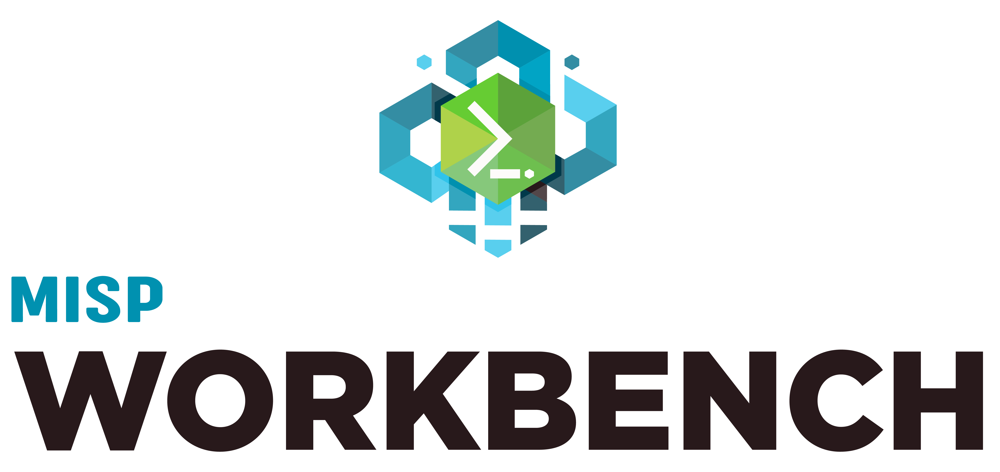

<!-- _class: title -->
<!-- _paginate: false -->
<!-- _footer: "" -->

# MISP Workbench

## MISP Integration Workshop

- What it is & why it exists
- Architecture
- Ingest, correlate, search, export
- Enrichment, hunts & alerting
- AI / MCP, reactors & notebooks
- Hands-on

---

<!-- _class: logo-br -->

# What is MISP Workbench?

**A modern, MISP-compatible threat intelligence platform.**

- Runs **standalone** — no full MISP instance required.
- Ingest feeds, **correlate** indicators, search, and export.
- Stays **compatible** with the wider MISP ecosystem.

> Built for the analyst's investigation workflow, not just data entry.

---

# Architecture

**A few focused services working together.**

- **FastAPI** backend exposes the API and UI.
- **OpenSearch** indexes attributes for fast search & correlation.
- **Celery** workers process feeds, hunts, and events asynchronously.
- **S3-compatible** or local storage for attachments.

> Index-first design — everything is searchable the moment it lands.

---

# Feed management

**Bring intelligence in from anywhere.**

- Ingest **MISP, CSV, JSON, and freetext** feeds.
- Run them **on a schedule** or trigger manually.
- New data is indexed and ready to correlate immediately.

> One place to pull together every source you track.

---

# Correlation & analysis

**Find the overlaps that matter.**

- **Batch** and **incremental** correlation scans over indexed attributes.
- Surface relationships and shared indicators across the dataset.
- Correlations update as new feed data arrives.

> Correlation is where isolated indicators become a picture.

---

# Search & exploration

**Ask precise questions, get fast answers.**

- **Lucene** query syntax against the OpenSearch index.
- Fast indicator lookups across the whole dataset.
- Pivot from a hit into related attributes and events.

> The dataset is only as useful as your ability to query it.

---

# Export

**Get intelligence back out in the right shape.**

- Export in **JSON, CSV, MISP, or STIX 2.1**.
- Feed downstream tools, partners, and detection pipelines.
- Same data, multiple standards-compliant formats.

> Interoperability keeps Workbench a good citizen of the ecosystem.

---

# Enrichment

**Add context automatically.**

- IOC enrichment powered by **misp-modules**.
- Augment indicators with WHOIS, geolocation, reputation, and more.
- Turn a bare indicator into an actionable one.

> Enrichment answers the "so what?" behind an indicator.

---

# Hunts & alerting

**Saved searches that keep working for you.**

- **Hunts** are saved searches that run **periodically**.
- A match **triggers an alert** — no manual re-running.
- Notifications are processed by **Celery** workers.

> Let the platform watch the feeds while you do other work.

---

# AI / MCP integration

**Query threat intel from your AI assistant.**

- Built-in **MCP Server** (Model Context Protocol).
- Ask **Claude, Cursor, and others** to query the dataset directly.
- Natural-language access to search, correlation, and context.

> Bring the intelligence to the tools analysts already use.

---

# Reactors & notebooks

**Automate and explore with Python.**

- **Reactor scripts** — Python that responds to platform events in a sandbox.
- **Interactive notebooks** for ad-hoc analyst exploration.
- Analytical tools pre-imported and ready to go.

> Scripted automation for the routine, notebooks for the novel.

---

<!-- _class: section -->
<!-- _footer: "" -->

# Hands-on

---

# Hands-on: ingest & explore

**Load a feed and query it end-to-end.**

1. **Add a feed** and run it — watch attributes get indexed.
2. **Search** with a Lucene query and pivot on a hit.
3. **Correlate** to surface overlaps with existing data.

> Full steps in the tutorial.

---

# Hands-on: hunt & export

**Turn a search into a standing alert, then share it.**

1. **Save a search as a hunt** and let it run on a schedule.
2. **Trigger** a match and watch the alert fire.
3. **Export** the results as STIX 2.1 for a downstream tool.

> Full steps in the tutorial.

---

<!-- _class: standout -->
<!-- _footer: "" -->

# Questions?
